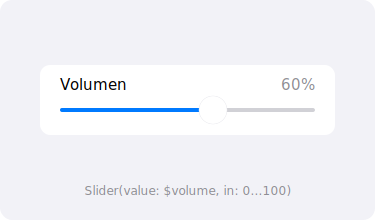

import PlaygroundLink from '@components/PlaygroundLink.astro';
import { Tabs, TabItem } from '@astrojs/starlight/components';

`Slider` lets the user select a value from a bounded range by dragging a thumb.

## Preview



## Basic Usage

<Tabs syncKey="lang">
  <TabItem label="Swift">
    ```swift
    struct SliderExample: View {
        @State private var value = 50.0

        var body: some View {
            VStack {
                Slider(value: $value, in: 0...100)
                Text("Value: \(value, specifier: "%.0f")")
            }
            .padding()
        }
    }
    ```
  </TabItem>
  <TabItem label="React">
    ```tsx
    "use client";
    import { useState } from "react";

    export default function SliderExample() {
      const [value, setValue] = useState(50);

      return (
        <div className="space-y-2 p-4">
          <input
            type="range"
            min={0}
            max={100}
            value={value}
            onChange={(e) => setValue(Number(e.target.value))}
            className="w-full accent-blue-500"
          />
          <p>Value: {value}</p>
        </div>
      );
    }
    ```
  </TabItem>
</Tabs>

<PlaygroundLink />

## Slider with Step

<Tabs syncKey="lang">
  <TabItem label="Swift">
    ```swift
    Slider(value: $temperature, in: 60...85, step: 1) {
        Text("Temperature")
    } minimumValueLabel: {
        Text("60°")
    } maximumValueLabel: {
        Text("85°")
    }
    ```
  </TabItem>
  <TabItem label="React">
    ```tsx
    "use client";
    import { useState } from "react";

    export default function TemperatureSlider() {
      const [temperature, setTemperature] = useState(72);

      return (
        <div className="space-y-2">
          <label className="text-sm font-medium">Temperature</label>
          <div className="flex items-center gap-3">
            <span className="text-sm text-gray-500">60°</span>
            <input
              type="range"
              min={60}
              max={85}
              step={1}
              value={temperature}
              onChange={(e) => setTemperature(Number(e.target.value))}
              className="flex-1 accent-blue-500"
            />
            <span className="text-sm text-gray-500">85°</span>
          </div>
        </div>
      );
    }
    ```
  </TabItem>
</Tabs>

<PlaygroundLink />

## Detecting Changes

<Tabs syncKey="lang">
  <TabItem label="Swift">
    ```swift
    Slider(value: $brightness, in: 0...1) {
        Text("Brightness")
    } onEditingChanged: { editing in
        if !editing {
            saveBrightness(brightness)
        }
    }
    ```
  </TabItem>
  <TabItem label="React">
    ```tsx
    "use client";
    import { useState } from "react";

    export default function BrightnessSlider() {
      const [brightness, setBrightness] = useState(0.5);

      function saveBrightness(value: number) {
        console.log("Saved brightness:", value);
      }

      return (
        <input
          type="range"
          min={0}
          max={1}
          step={0.01}
          value={brightness}
          onChange={(e) => setBrightness(Number(e.target.value))}
          onMouseUp={() => saveBrightness(brightness)}
          onTouchEnd={() => saveBrightness(brightness)}
          className="w-full accent-blue-500"
        />
      );
    }
    ```
  </TabItem>
</Tabs>

<PlaygroundLink />

:::tip
Combine `Slider` with `Text` to display the current value to the user.
:::

## Full Example

<Tabs syncKey="lang">
  <TabItem label="Swift">
    ```swift
    struct VolumeControlView: View {
        @State private var volume = 0.5
        @State private var brightness = 0.8

        var body: some View {
            Form {
                Section("Audio") {
                    HStack {
                        Image(systemName: "speaker.fill")
                        Slider(value: $volume, in: 0...1)
                        Image(systemName: "speaker.wave.3.fill")
                    }
                    Text("Volume: \(Int(volume * 100))%")
                        .foregroundStyle(.secondary)
                }
                Section("Display") {
                    HStack {
                        Image(systemName: "sun.min")
                        Slider(value: $brightness, in: 0...1)
                            .tint(.yellow)
                        Image(systemName: "sun.max")
                    }
                }
            }
        }
    }
    ```
  </TabItem>
  <TabItem label="React">
    ```tsx
    "use client";
    import { useState } from "react";

    export default function VolumeControl() {
      const [volume, setVolume] = useState(50);
      const [brightness, setBrightness] = useState(80);

      return (
        <form className="mx-auto max-w-md divide-y rounded-xl bg-white shadow">
          <fieldset className="space-y-2 p-4">
            <legend className="mb-2 text-sm font-semibold text-gray-500">Audio</legend>
            <div className="flex items-center gap-3">
              <span className="text-lg">🔈</span>
              <input
                type="range"
                min={0}
                max={100}
                value={volume}
                onChange={(e) => setVolume(Number(e.target.value))}
                className="flex-1 accent-blue-500"
              />
              <span className="text-lg">🔊</span>
            </div>
            <p className="text-sm text-gray-500">Volume: {volume}%</p>
          </fieldset>
          <fieldset className="space-y-2 p-4">
            <legend className="mb-2 text-sm font-semibold text-gray-500">Display</legend>
            <div className="flex items-center gap-3">
              <span className="text-lg">🔅</span>
              <input
                type="range"
                min={0}
                max={100}
                value={brightness}
                onChange={(e) => setBrightness(Number(e.target.value))}
                className="flex-1 accent-yellow-500"
              />
              <span className="text-lg">🔆</span>
            </div>
          </fieldset>
        </form>
      );
    }
    ```
  </TabItem>
</Tabs>

<PlaygroundLink />
