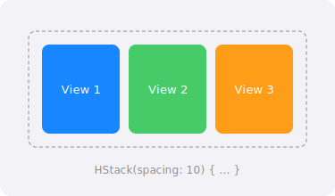

`HStack` (Horizontal Stack) arranges its child views in a horizontal row, from left to right.

## Preview



## Basic Usage

```swift
HStack {
    Image(systemName: "star.fill")
    Text("Favorite")
    Spacer()
    Text("5.0")
}
.padding()
```

> [Try in Swift Playground →](https://swiftfiddle.com/)

## Spacing and Alignment

```swift
HStack(alignment: .top, spacing: 30) {
    Text("Short")
    Text("Taller\ntext")
    Text("Medium\nheight")
}
```

> [Try in Swift Playground →](https://swiftfiddle.com/)

Vertical alignment: `.top`, `.center` (default), `.bottom`, `.firstTextBaseline`, `.lastTextBaseline`

:::tip
Use `Spacer()` between elements to distribute available space. Multiple spacers divide space equally.
:::

## Full Example

```swift
struct ProductCardView: View {
    var body: some View {
        HStack(spacing: 16) {
            Image(systemName: "cup.and.saucer.fill")
                .resizable()
                .frame(width: 60, height: 60)
                .foregroundColor(.brown)
                .padding()
                .background(Color.brown.opacity(0.1))
                .cornerRadius(12)

            VStack(alignment: .leading, spacing: 4) {
                Text("Cafe Latte").font(.headline)
                Text("With oat milk")
                    .font(.subheadline)
                    .foregroundColor(.secondary)
            }

            Spacer()

            Text("$4.99")
                .font(.title2).bold()
        }
        .padding()
        .background(Color(.systemBackground))
        .cornerRadius(16)
        .shadow(radius: 2)
    }
}
```

> [Try in Swift Playground →](https://swiftfiddle.com/)
