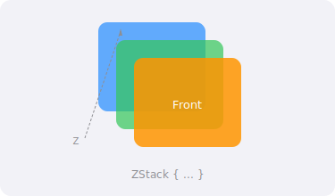

import { Tabs, TabItem } from '@astrojs/starlight/components';
import PlaygroundLink from '@components/PlaygroundLink.astro';

`ZStack` (Z-axis Stack) overlays its child views on top of each other. The first view is at the back, the last is at the front.

## Preview



## Basic Usage

<Tabs syncKey="lang">
  <TabItem label="Swift">
    ```swift
    ZStack {
        Color.blue
        Text("Hello World")
            .foregroundStyle(.white)
            .font(.largeTitle)
    }
    ```
  </TabItem>
  <TabItem label="React (Next.js)">
    ```tsx
    export default function OverlayLayout() {
      return (
        <div className="relative h-64 w-full bg-blue-500">
          <span className="absolute inset-0 flex items-center justify-center text-3xl font-bold text-white">
            Hello World
          </span>
        </div>
      );
    }
    ```
  </TabItem>
</Tabs>

<PlaygroundLink />

## Alignment

<Tabs syncKey="lang">
  <TabItem label="Swift">
    ```swift
    ZStack(alignment: .bottomTrailing) {
        Image(systemName: "photo")
            .resizable()
            .frame(width: 200, height: 200)

        Text("New")
            .padding(6)
            .background(Color.red)
            .foregroundStyle(.white)
            .clipShape(.rect(cornerRadius: 8))
            .padding(8)
    }
    ```
  </TabItem>
  <TabItem label="React (Next.js)">
    ```tsx
    export default function BadgeOverlay() {
      return (
        <div className="relative h-[200px] w-[200px]">
          
          <span className="absolute bottom-2 right-2 rounded-lg bg-red-500 px-2 py-1 text-sm text-white">
            New
          </span>
        </div>
      );
    }
    ```
  </TabItem>
</Tabs>

<PlaygroundLink />

Options: `.center` (default), `.topLeading`, `.top`, `.topTrailing`, `.leading`, `.trailing`, `.bottomLeading`, `.bottom`, `.bottomTrailing`

:::tip
Use `.zIndex()` to change stacking order without moving views in code.
:::

## Full Example

<Tabs syncKey="lang">
  <TabItem label="Swift">
    ```swift
    struct BadgeCardView: View {
        let notifications = 5

        var body: some View {
            ZStack(alignment: .topTrailing) {
                VStack(alignment: .leading, spacing: 12) {
                    Image(systemName: "envelope.fill")
                        .font(.largeTitle)
                        .foregroundStyle(.blue)
                    Text("Messages").font(.headline)
                    Text("You have unread messages")
                        .font(.caption)
                        .foregroundStyle(.secondary)
                }
                .padding()
                .frame(width: 180, height: 150)
                .background(Color(.systemBackground))
                .clipShape(.rect(cornerRadius: 16))
                .shadow(radius: 4)

                if notifications > 0 {
                    Text("\(notifications)")
                        .font(.caption2).bold()
                        .foregroundStyle(.white)
                        .frame(width: 24, height: 24)
                        .background(Color.red)
                        .clipShape(Circle())
                        .offset(x: 8, y: -8)
                }
            }
        }
    }
    ```
  </TabItem>
  <TabItem label="React (Next.js)">
    ```tsx
    export default function BadgeCard() {
      const notifications = 5;

      return (
        <div className="relative w-[180px]">
          <div className="flex flex-col items-start gap-3 rounded-2xl bg-white p-4 shadow-md"
               style={{ height: 150 }}>
            <span className="text-3xl text-blue-500">✉️</span>
            <span className="font-semibold">Messages</span>
            <span className="text-xs text-gray-500">You have unread messages</span>
          </div>

          {notifications > 0 && (
            <span className="absolute -right-2 -top-2 flex h-6 w-6 items-center justify-center rounded-full bg-red-500 text-xs font-bold text-white">
              {notifications}
            </span>
          )}
        </div>
      );
    }
    ```
  </TabItem>
</Tabs>

<PlaygroundLink />
