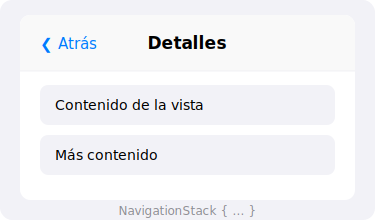

import PlaygroundLink from '@components/PlaygroundLink.astro';
import { Tabs, TabItem } from '@astrojs/starlight/components';

`NavigationStack` provides a navigation stack with animated transitions and automatic back buttons.

## Preview



## Basic Usage

<Tabs syncKey="lang">
  <TabItem label="Swift">
    ```swift
    NavigationStack {
        List {
            NavigationLink("Profile") {
                Text("Profile View")
            }
            NavigationLink("Settings") {
                Text("Settings View")
            }
        }
        .navigationTitle("Home")
    }
    ```
  </TabItem>
  <TabItem label="React">
    ```tsx
    import Link from "next/link";

    export default function HomePage() {
      return (
        <div>
          <h1 className="p-4 text-2xl font-bold">Home</h1>
          <ul className="divide-y divide-gray-200">
            <li>
              <Link href="/profile" className="block px-4 py-3 hover:bg-gray-50">
                Profile
              </Link>
            </li>
            <li>
              <Link href="/settings" className="block px-4 py-3 hover:bg-gray-50">
                Settings
              </Link>
            </li>
          </ul>
        </div>
      );
    }
    ```
  </TabItem>
</Tabs>

<PlaygroundLink />

## NavigationLink with Data

<Tabs syncKey="lang">
  <TabItem label="Swift">
    ```swift
    struct Fruit: Identifiable, Hashable {
        let id = UUID()
        let name: String
    }

    struct FruitsView: View {
        let fruits = [Fruit(name: "Apple"), Fruit(name: "Banana")]

        var body: some View {
            NavigationStack {
                List(fruits) { fruit in
                    NavigationLink(value: fruit) {
                        Text(fruit.name)
                    }
                }
                .navigationTitle("Fruits")
                .navigationDestination(for: Fruit.self) { fruit in
                    Text("Detail: \(fruit.name)").font(.largeTitle)
                }
            }
        }
    }
    ```
  </TabItem>
  <TabItem label="React">
    ```tsx
    // app/fruits/page.tsx — List page with dynamic links
    import Link from "next/link";

    const fruits = [
      { id: "1", name: "Apple" },
      { id: "2", name: "Banana" },
    ];

    export default function FruitsPage() {
      return (
        <div>
          <h1 className="p-4 text-2xl font-bold">Fruits</h1>
          <ul className="divide-y divide-gray-200">
            {fruits.map((fruit) => (
              <li key={fruit.id}>
                <Link
                  href={`/fruits/${fruit.id}`}
                  className="block px-4 py-3 hover:bg-gray-50"
                >
                  {fruit.name}
                </Link>
              </li>
            ))}
          </ul>
        </div>
      );
    }

    // app/fruits/[id]/page.tsx — Detail page
    // export default function FruitDetail({ params }: { params: { id: string } }) {
    //   return <h1 className="p-4 text-4xl">Detail: {params.id}</h1>;
    // }
    ```
  </TabItem>
</Tabs>

<PlaygroundLink />

## Toolbar

<Tabs syncKey="lang">
  <TabItem label="Swift">
    ```swift
    NavigationStack {
        Text("Content")
            .navigationTitle("My App")
            .toolbar {
                ToolbarItem(placement: .navigationBarTrailing) {
                    Button { } label: { Image(systemName: "plus") }
                }
            }
    }
    ```
  </TabItem>
  <TabItem label="React">
    ```tsx
    export default function MyAppPage() {
      return (
        <div>
          <header className="flex items-center justify-between border-b px-4 py-3">
            <h1 className="text-xl font-bold">My App</h1>
            <button className="rounded-full p-2 hover:bg-gray-100">
              <span className="text-xl">＋</span>
            </button>
          </header>
          <main className="p-4">Content</main>
        </div>
      );
    }
    ```
  </TabItem>
</Tabs>

<PlaygroundLink />

:::tip
`NavigationStack` replaces `NavigationView` since iOS 16. Always use `NavigationStack` in new projects.
:::

## Full Example

<Tabs syncKey="lang">
  <TabItem label="Swift">
    ```swift
    struct SettingsAppView: View {
        var body: some View {
            NavigationStack {
                List {
                    Section("Account") {
                        NavigationLink { Text("Profile") } label: {
                            Label("Profile", systemImage: "person")
                        }
                        NavigationLink { Text("Notifications") } label: {
                            Label("Notifications", systemImage: "bell")
                        }
                    }
                    Section("General") {
                        NavigationLink { Text("Appearance") } label: {
                            Label("Appearance", systemImage: "paintbrush")
                        }
                        NavigationLink { Text("Privacy") } label: {
                            Label("Privacy", systemImage: "lock")
                        }
                    }
                }
                .navigationTitle("Settings")
            }
        }
    }
    ```
  </TabItem>
  <TabItem label="React">
    ```tsx
    import Link from "next/link";

    const sections = [
      {
        title: "Account",
        items: [
          { label: "Profile", icon: "👤", href: "/settings/profile" },
          { label: "Notifications", icon: "🔔", href: "/settings/notifications" },
        ],
      },
      {
        title: "General",
        items: [
          { label: "Appearance", icon: "🎨", href: "/settings/appearance" },
          { label: "Privacy", icon: "🔒", href: "/settings/privacy" },
        ],
      },
    ];

    export default function SettingsPage() {
      return (
        <div className="mx-auto max-w-md">
          <h1 className="p-4 text-2xl font-bold">Settings</h1>
          {sections.map((section) => (
            <div key={section.title} className="mb-4">
              <h2 className="px-4 py-2 text-sm font-semibold text-gray-500 bg-gray-50">
                {section.title}
              </h2>
              <ul className="divide-y divide-gray-200">
                {section.items.map((item) => (
                  <li key={item.label}>
                    <Link
                      href={item.href}
                      className="flex items-center gap-3 px-4 py-3 hover:bg-gray-50"
                    >
                      <span>{item.icon}</span>
                      <span>{item.label}</span>
                    </Link>
                  </li>
                ))}
              </ul>
            </div>
          ))}
        </div>
      );
    }
    ```
  </TabItem>
</Tabs>

<PlaygroundLink />
