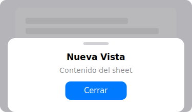

import PlaygroundLink from '@components/PlaygroundLink.astro';
import { Tabs, TabItem } from '@astrojs/starlight/components';

The `.sheet` modifier presents a modal view that slides up from the bottom.

## Preview



## Basic Usage

<Tabs syncKey="lang">
  <TabItem label="Swift">
    ```swift
    struct SheetExample: View {
        @State private var showSheet = false

        var body: some View {
            Button("Open Sheet") { showSheet = true }
            .sheet(isPresented: $showSheet) {
                Text("Hello from the Sheet!")
                    .font(.title)
            }
        }
    }
    ```
  </TabItem>
  <TabItem label="React">
    ```tsx
    "use client";
    import { useState } from "react";

    export default function SheetExample() {
      const [showSheet, setShowSheet] = useState(false);

      return (
        <>
          <button
            onClick={() => setShowSheet(true)}
            className="px-4 py-2 bg-blue-500 text-white rounded-lg"
          >
            Open Sheet
          </button>

          {showSheet && (
            <div className="fixed inset-0 bg-black/50 flex items-end justify-center z-50">
              <div className="bg-white rounded-t-2xl p-6 w-full max-w-lg">
                <h2 className="text-xl font-bold">Hello from the Sheet!</h2>
                <button
                  onClick={() => setShowSheet(false)}
                  className="mt-4 px-4 py-2 bg-gray-200 rounded-lg"
                >
                  Close
                </button>
              </div>
            </div>
          )}
        </>
      );
    }
    ```
  </TabItem>
</Tabs>

<PlaygroundLink />

## Dismissing a Sheet

<Tabs syncKey="lang">
  <TabItem label="Swift">
    ```swift
    struct DetailSheet: View {
        @Environment(\.dismiss) var dismiss

        var body: some View {
            NavigationStack {
                Text("Sheet Content")
                    .toolbar {
                        ToolbarItem(placement: .navigationBarTrailing) {
                            Button("Close") { dismiss() }
                        }
                    }
            }
        }
    }
    ```
  </TabItem>
  <TabItem label="React">
    ```tsx
    "use client";

    interface DetailSheetProps {
      onClose: () => void;
    }

    export default function DetailSheet({ onClose }: DetailSheetProps) {
      return (
        <div className="fixed inset-0 bg-black/50 flex items-end justify-center z-50">
          <div className="bg-white rounded-t-2xl w-full max-w-lg">
            <div className="flex justify-between items-center p-4 border-b">
              <h2 className="text-lg font-semibold">Sheet Content</h2>
              <button onClick={onClose} className="text-blue-500 font-medium">
                Close
              </button>
            </div>
            <div className="p-4">
              <p>Sheet Content</p>
            </div>
          </div>
        </div>
      );
    }
    ```
  </TabItem>
</Tabs>

<PlaygroundLink />

## fullScreenCover

<Tabs syncKey="lang">
  <TabItem label="Swift">
    ```swift
    .fullScreenCover(isPresented: $show) {
        FullScreenView()
    }
    ```
  </TabItem>
  <TabItem label="React">
    ```tsx
    {show && (
      <div className="fixed inset-0 bg-white z-50">
        <FullScreenView />
      </div>
    )}
    ```
  </TabItem>
</Tabs>

<PlaygroundLink />

## presentationDetents

<Tabs syncKey="lang">
  <TabItem label="Swift">
    ```swift
    .sheet(isPresented: $show) {
        SheetContent()
            .presentationDetents([.medium, .large])
            .presentationDragIndicator(.visible)
    }
    ```
  </TabItem>
  <TabItem label="React">
    ```tsx
    {show && (
      <div className="fixed inset-0 bg-black/50 flex items-end z-50">
        <div className="bg-white rounded-t-2xl w-full max-h-[50vh] overflow-y-auto resize-y">
          {/* Drag indicator */}
          <div className="w-10 h-1 bg-gray-300 rounded-full mx-auto mt-2" />
          <SheetContent />
        </div>
      </div>
    )}
    ```
  </TabItem>
</Tabs>

<PlaygroundLink />

:::tip
Use `.presentationDetents([.medium, .large])` to let users resize the sheet by dragging.
:::

## Full Example

<Tabs syncKey="lang">
  <TabItem label="Swift">
    ```swift
    struct NotesView: View {
        @State private var showForm = false
        @State private var notes = ["First note", "Second note"]

        var body: some View {
            NavigationStack {
                List(notes, id: \.self) { Text($0) }
                .navigationTitle("Notes")
                .toolbar {
                    Button { showForm = true } label: { Image(systemName: "plus") }
                }
                .sheet(isPresented: $showForm) {
                    NoteForm(notes: $notes)
                        .presentationDetents([.medium])
                }
            }
        }
    }

    struct NoteForm: View {
        @Binding var notes: [String]
        @State private var text = ""
        @Environment(\.dismiss) var dismiss

        var body: some View {
            NavigationStack {
                Form {
                    TextField("Write your note...", text: $text, axis: .vertical)
                        .lineLimit(3...6)
                }
                .navigationTitle("New Note")
                .navigationBarTitleDisplayMode(.inline)
                .toolbar {
                    ToolbarItem(placement: .cancellationAction) {
                        Button("Cancel") { dismiss() }
                    }
                    ToolbarItem(placement: .confirmationAction) {
                        Button("Save") { notes.append(text); dismiss() }
                            .disabled(text.isEmpty)
                    }
                }
            }
        }
    }
    ```
  </TabItem>
  <TabItem label="React">
    ```tsx
    "use client";
    import { useState } from "react";

    function NoteForm({
      onSave,
      onCancel,
    }: {
      onSave: (text: string) => void;
      onCancel: () => void;
    }) {
      const [text, setText] = useState("");

      return (
        <div className="fixed inset-0 bg-black/50 flex items-end justify-center z-50">
          <div className="bg-white rounded-t-2xl w-full max-w-lg max-h-[50vh]">
            <div className="flex justify-between items-center p-4 border-b">
              <button onClick={onCancel} className="text-blue-500">
                Cancel
              </button>
              <h2 className="font-semibold">New Note</h2>
              <button
                onClick={() => onSave(text)}
                disabled={!text.trim()}
                className="text-blue-500 font-semibold disabled:opacity-40"
              >
                Save
              </button>
            </div>
            <div className="p-4">
              <textarea
                value={text}
                onChange={(e) => setText(e.target.value)}
                placeholder="Write your note..."
                rows={4}
                className="w-full border rounded-lg p-2 resize-none"
              />
            </div>
          </div>
        </div>
      );
    }

    export default function NotesView() {
      const [showForm, setShowForm] = useState(false);
      const [notes, setNotes] = useState(["First note", "Second note"]);

      return (
        <div className="max-w-lg mx-auto">
          <div className="flex justify-between items-center p-4">
            <h1 className="text-2xl font-bold">Notes</h1>
            <button
              onClick={() => setShowForm(true)}
              className="text-2xl"
            >
              +
            </button>
          </div>
          <ul className="divide-y">
            {notes.map((note, i) => (
              <li key={i} className="p-4">{note}</li>
            ))}
          </ul>
          {showForm && (
            <NoteForm
              onCancel={() => setShowForm(false)}
              onSave={(text) => {
                setNotes([...notes, text]);
                setShowForm(false);
              }}
            />
          )}
        </div>
      );
    }
    ```
  </TabItem>
</Tabs>

<PlaygroundLink />
