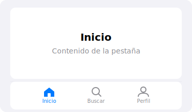

import PlaygroundLink from '@components/PlaygroundLink.astro';

`TabView` organizes content into tabs, showing a tab bar at the bottom of the screen.

## Preview



## Basic Usage

```swift
TabView {
    Text("Home")
        .tabItem { Label("Home", systemImage: "house") }

    Text("Search")
        .tabItem { Label("Search", systemImage: "magnifyingglass") }

    Text("Profile")
        .tabItem { Label("Profile", systemImage: "person") }
}
```

<PlaygroundLink />

## Programmatic Selection

```swift
struct MainApp: View {
    @State private var selectedTab = 0

    var body: some View {
        TabView(selection: $selectedTab) {
            HomeView()
                .tabItem { Label("Home", systemImage: "house") }
                .tag(0)
            SearchView()
                .tabItem { Label("Search", systemImage: "magnifyingglass") }
                .tag(1)
            ProfileView()
                .tabItem { Label("Profile", systemImage: "person") }
                .tag(2)
        }
    }
}
```

<PlaygroundLink />

## Badges

```swift
Text("Messages")
    .tabItem { Label("Messages", systemImage: "message") }
    .badge(5)
```

<PlaygroundLink />

## Page Style

```swift
TabView {
    Color.red
    Color.green
    Color.blue
}
.tabViewStyle(.page)
.indexViewStyle(.page(backgroundDisplayMode: .always))
```

<PlaygroundLink />

:::tip
Use `TabView` as the root container of your app. Each tab can contain its own independent `NavigationStack`.
:::

## Full Example

```swift
struct MyAppView: View {
    @State private var tab = 0
    @State private var unread = 3

    var body: some View {
        TabView(selection: $tab) {
            NavigationStack {
                List(0..<10) { i in
                    NavigationLink("Post \(i + 1)") {
                        Text("Post detail \(i + 1)")
                    }
                }
                .navigationTitle("Home")
            }
            .tabItem { Label("Home", systemImage: "house.fill") }
            .tag(0)

            NavigationStack {
                Text("Search content")
                    .navigationTitle("Search")
            }
            .tabItem { Label("Search", systemImage: "magnifyingglass") }
            .tag(1)

            NavigationStack {
                Text("Messages")
                    .navigationTitle("Messages")
            }
            .tabItem { Label("Messages", systemImage: "message.fill") }
            .badge(unread)
            .tag(2)
        }
    }
}
```

<PlaygroundLink />
