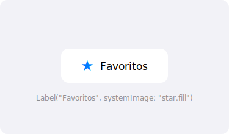

import PlaygroundLink from '@components/PlaygroundLink.astro';
import { Tabs, TabItem } from '@astrojs/starlight/components';

`Label` combines an icon and text in a single view, automatically adapting its layout to the context.

## Preview



## Basic Usage

<Tabs syncKey="lang">
  <TabItem label="Swift">
    ```swift
    Label("Favorites", systemImage: "star.fill")
    ```
  </TabItem>
  <TabItem label="React">
    ```tsx
    import { Star } from "lucide-react";

    export default function BasicLabel() {
      return (
        <span className="inline-flex items-center gap-2">
          <Star className="size-5" /> Favorites
        </span>
      );
    }
    ```
  </TabItem>
</Tabs>

<PlaygroundLink />

## Label Styles

<Tabs syncKey="lang">
  <TabItem label="Swift">
    ```swift
    VStack(spacing: 20) {
        Label("Automatic", systemImage: "star")
            .labelStyle(.automatic)

        Label("Title Only", systemImage: "star")
            .labelStyle(.titleOnly)

        Label("Icon Only", systemImage: "star")
            .labelStyle(.iconOnly)

        Label("Title and Icon", systemImage: "star")
            .labelStyle(.titleAndIcon)
    }
    ```
  </TabItem>
  <TabItem label="React">
    ```tsx
    import { Star } from "lucide-react";

    export default function LabelStyles() {
      return (
        <div className="flex flex-col gap-5 text-lg">
          {/* Icon + text (default) */}
          <span className="inline-flex items-center gap-2">
            <Star className="size-5" /> Automatic
          </span>
          {/* Title only */}
          <span>Title Only</span>
          {/* Icon only */}
          <span>
            <Star className="size-5" />
          </span>
          {/* Title and icon */}
          <span className="inline-flex items-center gap-2">
            <Star className="size-5" /> Title and Icon
          </span>
        </div>
      );
    }
    ```
  </TabItem>
</Tabs>

<PlaygroundLink />

## Custom Label

<Tabs syncKey="lang">
  <TabItem label="Swift">
    ```swift
    Label {
        Text("Custom Label")
            .font(.headline)
            .foregroundStyle(.primary)
    } icon: {
        Circle()
            .fill(Color.blue)
            .frame(width: 30, height: 30)
            .overlay(
                Image(systemName: "person")
                    .foregroundStyle(.white)
            )
    }
    ```
  </TabItem>
  <TabItem label="React">
    ```tsx
    import { User } from "lucide-react";

    export default function CustomLabel() {
      return (
        <div className="flex items-center gap-3">
          <div className="flex size-8 items-center justify-center rounded-full bg-blue-500">
            <User className="size-4 text-white" />
          </div>
          <span className="font-semibold">Custom Label</span>
        </div>
      );
    }
    ```
  </TabItem>
</Tabs>

<PlaygroundLink />

:::tip
`Label` automatically adjusts its layout based on the context — in a toolbar it might show only the icon, while in a list it shows both.
:::

## Full Example

<Tabs syncKey="lang">
  <TabItem label="Swift">
    ```swift
    struct SettingsListView: View {
        var body: some View {
            List {
                Label("Profile", systemImage: "person.fill")
                Label("Notifications", systemImage: "bell.fill")
                Label("Privacy", systemImage: "lock.fill")
                Label("Storage", systemImage: "internaldrive")
                Label("Help", systemImage: "questionmark.circle")
            }
        }
    }
    ```
  </TabItem>
  <TabItem label="React">
    ```tsx
    import { User, Bell, Lock, HardDrive, HelpCircle } from "lucide-react";

    export default function SettingsListView() {
      const items = [
        { icon: User, label: "Profile" },
        { icon: Bell, label: "Notifications" },
        { icon: Lock, label: "Privacy" },
        { icon: HardDrive, label: "Storage" },
        { icon: HelpCircle, label: "Help" },
      ];

      return (
        <div className="divide-y rounded-lg border">
          {items.map(({ icon: Icon, label }) => (
            <div key={label} className="flex items-center gap-3 px-4 py-3">
              <Icon className="size-5" /> {label}
            </div>
          ))}
        </div>
      );
    }
    ```
  </TabItem>
</Tabs>

<PlaygroundLink />
