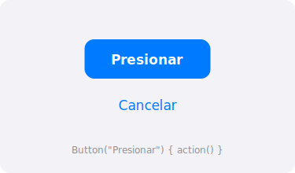

import PlaygroundLink from '@components/PlaygroundLink.astro';
import { Tabs, TabItem } from '@astrojs/starlight/components';

El componente `Button` es uno de los controles más utilizados en SwiftUI. Permite crear elementos interactivos que ejecutan una acción cuando el usuario los presiona.

## Vista previa



## Uso básico

<Tabs syncKey="lang">
  <TabItem label="Swift">
    ```swift
    Button("Presionar") {
        print("¡Botón presionado!")
    }
    ```
  </TabItem>
  <TabItem label="React">
    ```tsx
    export default function BotonBasico() {
      return (
        <button
          onClick={() => console.log("¡Botón presionado!")}
          className="px-4 py-2 bg-blue-500 text-white rounded-lg hover:bg-blue-600 transition"
        >
          Presionar
        </button>
      );
    }
    ```
  </TabItem>
</Tabs>

<PlaygroundLink />

## Button con label personalizado

Puedes crear botones con contenido visual más complejo usando el parámetro `label`:

<Tabs syncKey="lang">
  <TabItem label="Swift">
    ```swift
    Button {
        print("Guardar")
    } label: {
        HStack {
            Image(systemName: "square.and.arrow.down")
            Text("Guardar")
        }
        .padding()
        .background(Color.blue)
        .foregroundStyle(.white)
        .clipShape(.rect(cornerRadius: 10))
    }
    ```
  </TabItem>
  <TabItem label="React">
    ```tsx
    import { ArrowDownTrayIcon } from "@heroicons/react/24/solid";

    export default function BotonGuardar() {
      return (
        <button
          onClick={() => console.log("Guardar")}
          className="flex items-center gap-2 px-4 py-2 bg-blue-500 text-white rounded-lg hover:bg-blue-600 transition"
        >
          <ArrowDownTrayIcon className="w-5 h-5" />
          Guardar
        </button>
      );
    }
    ```
  </TabItem>
</Tabs>

<PlaygroundLink />

## Estilos de botón

SwiftUI ofrece varios estilos predefinidos:

<Tabs syncKey="lang">
  <TabItem label="Swift">
    ```swift
    VStack(spacing: 20) {
        Button("Automático") { }
            .buttonStyle(.automatic)

        Button("Con borde") { }
            .buttonStyle(.bordered)

        Button("Prominente") { }
            .buttonStyle(.borderedProminent)

        Button("Sin borde") { }
            .buttonStyle(.borderless)

        Button("Simple") { }
            .buttonStyle(.plain)
    }
    ```
  </TabItem>
  <TabItem label="React">
    ```tsx
    export default function EstilosBotones() {
      return (
        <div className="flex flex-col gap-5">
          <button className="px-4 py-2 bg-blue-500 text-white rounded-lg hover:bg-blue-600 transition">
            Automático
          </button>
          <button className="px-4 py-2 border border-blue-500 text-blue-500 rounded-lg hover:bg-blue-50 transition">
            Con borde
          </button>
          <button className="px-4 py-2 bg-blue-500 text-white rounded-lg shadow-md hover:bg-blue-600 transition">
            Prominente
          </button>
          <button className="px-4 py-2 text-blue-500 hover:underline transition">
            Sin borde
          </button>
          <button className="px-4 py-2 text-gray-800 hover:text-gray-600 transition">
            Simple
          </button>
        </div>
      );
    }
    ```
  </TabItem>
</Tabs>

<PlaygroundLink />

## Roles de botón

Los roles indican la intención semántica del botón:

<Tabs syncKey="lang">
  <TabItem label="Swift">
    ```swift
    VStack(spacing: 20) {
        Button("Eliminar", role: .destructive) {
            // Acción destructiva
        }

        Button("Cancelar", role: .cancel) {
            // Acción de cancelación
        }
    }
    ```
  </TabItem>
  <TabItem label="React">
    ```tsx
    export default function RolesBotones() {
      return (
        <div className="flex flex-col gap-5">
          <button className="px-4 py-2 bg-red-500 text-white rounded-lg hover:bg-red-600 transition">
            Eliminar
          </button>
          <button className="px-4 py-2 bg-gray-200 text-gray-700 rounded-lg hover:bg-gray-300 transition">
            Cancelar
          </button>
        </div>
      );
    }
    ```
  </TabItem>
</Tabs>

<PlaygroundLink />

## Modificadores comunes

| Modificador | Descripción |
|---|---|
| `.buttonStyle(.bordered)` | Aplica estilo con borde |
| `.tint(.blue)` | Cambia el color de acento |
| `.disabled(true)` | Deshabilita el botón |
| `.controlSize(.large)` | Cambia el tamaño del control |
| `.buttonBorderShape(.capsule)` | Forma de cápsula |

:::tip
Usa `role: .destructive` para acciones que eliminan datos. SwiftUI automáticamente mostrará el botón en rojo.
:::

## Ejemplo completo

<Tabs syncKey="lang">
  <TabItem label="Swift">
    ```swift
    struct BotonEjemploView: View {
        @State private var contador = 0

        var body: some View {
            VStack(spacing: 20) {
                Text("Contador: \(contador)")
                    .font(.largeTitle)

                HStack(spacing: 16) {
                    Button("Restar") {
                        contador -= 1
                    }
                    .buttonStyle(.bordered)
                    .tint(.red)

                    Button("Sumar") {
                        contador += 1
                    }
                    .buttonStyle(.borderedProminent)
                    .tint(.green)
                }

                Button("Reiniciar", role: .destructive) {
                    contador = 0
                }
                .disabled(contador == 0)
            }
            .padding()
        }
    }
    ```
  </TabItem>
  <TabItem label="React">
    ```tsx
    "use client";

    import { useState } from "react";

    export default function BotonEjemplo() {
      const [contador, setContador] = useState(0);

      return (
        <div className="flex flex-col items-center gap-5 p-6">
          <p className="text-4xl font-bold">Contador: {contador}</p>

          <div className="flex gap-4">
            <button
              onClick={() => setContador(contador - 1)}
              className="px-4 py-2 border border-red-500 text-red-500 rounded-lg hover:bg-red-50 transition"
            >
              Restar
            </button>
            <button
              onClick={() => setContador(contador + 1)}
              className="px-4 py-2 bg-green-500 text-white rounded-lg shadow-md hover:bg-green-600 transition"
            >
              Sumar
            </button>
          </div>

          <button
            onClick={() => setContador(0)}
            disabled={contador === 0}
            className="px-4 py-2 bg-red-500 text-white rounded-lg hover:bg-red-600 transition disabled:opacity-50 disabled:cursor-not-allowed"
          >
            Reiniciar
          </button>
        </div>
      );
    }
    ```
  </TabItem>
</Tabs>

<PlaygroundLink />
