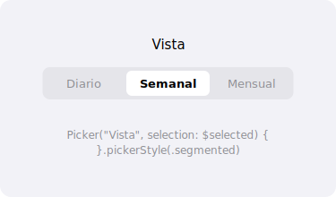

import PlaygroundLink from '@components/PlaygroundLink.astro';
import { Tabs, TabItem } from '@astrojs/starlight/components';

El componente `Picker` permite al usuario seleccionar un valor de una lista de opciones. Ofrece múltiples estilos de presentación.

## Vista previa



## Uso básico

<Tabs syncKey="lang">
  <TabItem label="Swift">
    ```swift
    struct PickerEjemplo: View {
        @State private var seleccion = "Manzana"
        let frutas = ["Manzana", "Plátano", "Naranja", "Uva"]

        var body: some View {
            Picker("Fruta favorita", selection: $seleccion) {
                ForEach(frutas, id: \.self) { fruta in
                    Text(fruta)
                }
            }
        }
    }
    ```
  </TabItem>
  <TabItem label="React">
    ```tsx
    "use client";
    import { useState } from "react";

    export default function PickerEjemplo() {
      const [seleccion, setSeleccion] = useState("Manzana");
      const frutas = ["Manzana", "Plátano", "Naranja", "Uva"];

      return (
        <label className="flex flex-col gap-1">
          <span className="text-sm font-medium">Fruta favorita</span>
          <select
            value={seleccion}
            onChange={(e) => setSeleccion(e.target.value)}
            className="rounded-md border border-gray-300 px-3 py-2"
          >
            {frutas.map((fruta) => (
              <option key={fruta} value={fruta}>
                {fruta}
              </option>
            ))}
          </select>
        </label>
      );
    }
    ```
  </TabItem>
</Tabs>

<PlaygroundLink />

## Estilos de Picker

### Segmentado

<Tabs syncKey="lang">
  <TabItem label="Swift">
    ```swift
    Picker("Período", selection: $periodo) {
        Text("Diario").tag("diario")
        Text("Semanal").tag("semanal")
        Text("Mensual").tag("mensual")
    }
    .pickerStyle(.segmented)
    ```
  </TabItem>
  <TabItem label="React">
    ```tsx
    "use client";
    import { useState } from "react";

    const opciones = ["diario", "semanal", "mensual"] as const;

    export default function SegmentedPicker() {
      const [periodo, setPeriodo] = useState("diario");

      return (
        <div className="inline-flex rounded-lg border border-gray-300 overflow-hidden">
          {opciones.map((op) => (
            <button
              key={op}
              onClick={() => setPeriodo(op)}
              className={`px-4 py-2 text-sm capitalize ${
                periodo === op
                  ? "bg-blue-500 text-white"
                  : "bg-white text-gray-700 hover:bg-gray-100"
              }`}
            >
              {op}
            </button>
          ))}
        </div>
      );
    }
    ```
  </TabItem>
</Tabs>

<PlaygroundLink />

### Menú (por defecto en iOS)

<Tabs syncKey="lang">
  <TabItem label="Swift">
    ```swift
    Picker("Color", selection: $color) {
        ForEach(colores, id: \.self) { color in
            Text(color)
        }
    }
    .pickerStyle(.menu)
    ```
  </TabItem>
  <TabItem label="React">
    ```tsx
    "use client";
    import { useState } from "react";

    const colores = ["Rojo", "Azul", "Verde", "Amarillo"];

    export default function MenuPicker() {
      const [color, setColor] = useState(colores[0]);

      return (
        <label className="flex flex-col gap-1">
          <span className="text-sm font-medium">Color</span>
          <select
            value={color}
            onChange={(e) => setColor(e.target.value)}
            className="rounded-md border border-gray-300 px-3 py-2"
          >
            {colores.map((c) => (
              <option key={c} value={c}>{c}</option>
            ))}
          </select>
        </label>
      );
    }
    ```
  </TabItem>
</Tabs>

<PlaygroundLink />

### Rueda

<Tabs syncKey="lang">
  <TabItem label="Swift">
    ```swift
    Picker("Edad", selection: $edad) {
        ForEach(18...99, id: \.self) { num in
            Text("\(num) años")
        }
    }
    .pickerStyle(.wheel)
    ```
  </TabItem>
  <TabItem label="React">
    ```tsx
    "use client";
    import { useState } from "react";

    const edades = Array.from({ length: 82 }, (_, i) => i + 18);

    export default function WheelPicker() {
      const [edad, setEdad] = useState(18);

      return (
        <label className="flex flex-col gap-1">
          <span className="text-sm font-medium">Edad</span>
          <select
            value={edad}
            onChange={(e) => setEdad(Number(e.target.value))}
            size={5}
            className="rounded-md border border-gray-300 px-3 py-2 overflow-y-auto"
          >
            {edades.map((num) => (
              <option key={num} value={num}>
                {num} años
              </option>
            ))}
          </select>
        </label>
      );
    }
    ```
  </TabItem>
</Tabs>

<PlaygroundLink />

## Picker con enum

<Tabs syncKey="lang">
  <TabItem label="Swift">
    ```swift
    enum Tamano: String, CaseIterable {
        case pequeno = "Pequeño"
        case mediano = "Mediano"
        case grande = "Grande"
    }

    struct TamanoPickerView: View {
        @State private var tamano: Tamano = .mediano

        var body: some View {
            Picker("Tamaño", selection: $tamano) {
                ForEach(Tamano.allCases, id: \.self) { t in
                    Text(t.rawValue).tag(t)
                }
            }
            .pickerStyle(.segmented)
        }
    }
    ```
  </TabItem>
  <TabItem label="React">
    ```tsx
    "use client";
    import { useState } from "react";

    const Tamano = {
      pequeno: "Pequeño",
      mediano: "Mediano",
      grande: "Grande",
    } as const;

    type TamanoKey = keyof typeof Tamano;

    export default function TamanoPicker() {
      const [tamano, setTamano] = useState<TamanoKey>("mediano");

      return (
        <div className="inline-flex rounded-lg border border-gray-300 overflow-hidden">
          {(Object.entries(Tamano) as [TamanoKey, string][]).map(
            ([key, label]) => (
              <button
                key={key}
                onClick={() => setTamano(key)}
                className={`px-4 py-2 text-sm ${
                  tamano === key
                    ? "bg-blue-500 text-white"
                    : "bg-white text-gray-700 hover:bg-gray-100"
                }`}
              >
                {label}
              </button>
            )
          )}
        </div>
      );
    }
    ```
  </TabItem>
</Tabs>

<PlaygroundLink />

## Modificadores comunes

| Modificador | Descripción |
|---|---|
| `.pickerStyle(.segmented)` | Estilo segmentado |
| `.pickerStyle(.wheel)` | Estilo rueda |
| `.pickerStyle(.menu)` | Estilo menú desplegable |
| `.pickerStyle(.inline)` | Estilo en línea |

:::tip
Usa `.pickerStyle(.segmented)` cuando tengas 2-5 opciones cortas. Para más opciones, usa `.menu` o `.wheel`.
:::

## Ejemplo completo

<Tabs syncKey="lang">
  <TabItem label="Swift">
    ```swift
    struct PedidoView: View {
        @State private var tamano = "Mediano"
        @State private var bebida = "Café"
        @State private var cantidad = 1

        let tamanos = ["Pequeño", "Mediano", "Grande"]
        let bebidas = ["Café", "Té", "Chocolate", "Jugo"]

        var body: some View {
            Form {
                Section("Tu pedido") {
                    Picker("Bebida", selection: $bebida) {
                        ForEach(bebidas, id: \.self) { b in
                            Text(b)
                        }
                    }

                    Picker("Tamaño", selection: $tamano) {
                        ForEach(tamanos, id: \.self) { t in
                            Text(t)
                        }
                    }
                    .pickerStyle(.segmented)

                    Picker("Cantidad", selection: $cantidad) {
                        ForEach(1...10, id: \.self) { n in
                            Text("\(n)")
                        }
                    }
                }

                Section("Resumen") {
                    Text("\(cantidad)x \(bebida) (\(tamano))")
                        .font(.headline)
                }
            }
        }
    }
    ```
  </TabItem>
  <TabItem label="React">
    ```tsx
    "use client";
    import { useState } from "react";

    const tamanos = ["Pequeño", "Mediano", "Grande"];
    const bebidas = ["Café", "Té", "Chocolate", "Jugo"];
    const cantidades = Array.from({ length: 10 }, (_, i) => i + 1);

    export default function PedidoForm() {
      const [tamano, setTamano] = useState("Mediano");
      const [bebida, setBebida] = useState("Café");
      const [cantidad, setCantidad] = useState(1);

      return (
        <form className="mx-auto max-w-md space-y-6 rounded-xl border p-6">
          <fieldset className="space-y-4">
            <legend className="text-lg font-semibold">Tu pedido</legend>

            <label className="flex flex-col gap-1">
              <span className="text-sm font-medium">Bebida</span>
              <select
                value={bebida}
                onChange={(e) => setBebida(e.target.value)}
                className="rounded-md border border-gray-300 px-3 py-2"
              >
                {bebidas.map((b) => (
                  <option key={b} value={b}>{b}</option>
                ))}
              </select>
            </label>

            <div className="flex flex-col gap-1">
              <span className="text-sm font-medium">Tamaño</span>
              <div className="inline-flex rounded-lg border border-gray-300 overflow-hidden">
                {tamanos.map((t) => (
                  <button
                    key={t}
                    type="button"
                    onClick={() => setTamano(t)}
                    className={`px-4 py-2 text-sm ${
                      tamano === t
                        ? "bg-blue-500 text-white"
                        : "bg-white text-gray-700 hover:bg-gray-100"
                    }`}
                  >
                    {t}
                  </button>
                ))}
              </div>
            </div>

            <label className="flex flex-col gap-1">
              <span className="text-sm font-medium">Cantidad</span>
              <select
                value={cantidad}
                onChange={(e) => setCantidad(Number(e.target.value))}
                className="rounded-md border border-gray-300 px-3 py-2"
              >
                {cantidades.map((n) => (
                  <option key={n} value={n}>{n}</option>
                ))}
              </select>
            </label>
          </fieldset>

          <div className="border-t pt-4">
            <p className="text-lg font-semibold">
              {cantidad}x {bebida} ({tamano})
            </p>
          </div>
        </form>
      );
    }
    ```
  </TabItem>
</Tabs>

<PlaygroundLink />
