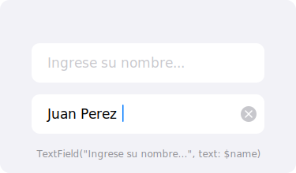

`TextField` permite al usuario ingresar texto. `SecureField` oculta el texto ingresado, ideal para contraseñas.

## Vista previa



## Uso básico

```swift
struct TextFieldEjemplo: View {
    @State private var nombre = ""

    var body: some View {
        TextField("Ingresa tu nombre", text: $nombre)
            .textFieldStyle(.roundedBorder)
            .padding()
    }
}
```

> [Probar en Swift Playground →](https://swiftfiddle.com/)

## SecureField para contraseñas

```swift
@State private var contrasena = ""

SecureField("Contraseña", text: $contrasena)
    .textFieldStyle(.roundedBorder)
```

> [Probar en Swift Playground →](https://swiftfiddle.com/)

## Tipos de teclado

```swift
TextField("Correo electrónico", text: $email)
    .keyboardType(.emailAddress)
    .textContentType(.emailAddress)
    .autocapitalization(.none)

TextField("Teléfono", text: $telefono)
    .keyboardType(.phonePad)

TextField("Sitio web", text: $url)
    .keyboardType(.URL)
    .autocapitalization(.none)
```

> [Probar en Swift Playground →](https://swiftfiddle.com/)

## TextField con formato

```swift
// Campo numérico
TextField("Edad", value: $edad, format: .number)
    .keyboardType(.numberPad)

// Campo de moneda
TextField("Precio", value: $precio, format: .currency(code: "MXN"))
    .keyboardType(.decimalPad)
```

> [Probar en Swift Playground →](https://swiftfiddle.com/)

## Modificadores comunes

| Modificador | Descripción |
|---|---|
| `.textFieldStyle(.roundedBorder)` | Borde redondeado |
| `.keyboardType(.emailAddress)` | Tipo de teclado |
| `.autocapitalization(.none)` | Sin mayúsculas automáticas |
| `.textContentType(.password)` | Sugerencia de autorellenado |
| `.submitLabel(.done)` | Texto del botón de envío |
| `.focused($estaEnfocado)` | Control del foco |

:::tip
Usa `@FocusState` para controlar programáticamente qué campo tiene el foco del teclado.
:::

## Ejemplo completo

```swift
struct FormularioRegistroView: View {
    @State private var nombre = ""
    @State private var email = ""
    @State private var contrasena = ""
    @FocusState private var campoEnfocado: Campo?

    enum Campo {
        case nombre, email, contrasena
    }

    var formularioValido: Bool {
        !nombre.isEmpty && email.contains("@") && contrasena.count >= 8
    }

    var body: some View {
        Form {
            Section("Datos personales") {
                TextField("Nombre completo", text: $nombre)
                    .textContentType(.name)
                    .focused($campoEnfocado, equals: .nombre)
                    .submitLabel(.next)
                    .onSubmit { campoEnfocado = .email }

                TextField("Correo electrónico", text: $email)
                    .keyboardType(.emailAddress)
                    .textContentType(.emailAddress)
                    .autocapitalization(.none)
                    .focused($campoEnfocado, equals: .email)
                    .submitLabel(.next)
                    .onSubmit { campoEnfocado = .contrasena }

                SecureField("Contraseña (mín. 8 caracteres)", text: $contrasena)
                    .textContentType(.newPassword)
                    .focused($campoEnfocado, equals: .contrasena)
                    .submitLabel(.done)
            }

            Section {
                Button("Registrarse") {
                    // Enviar formulario
                    campoEnfocado = nil
                }
                .disabled(!formularioValido)
                .frame(maxWidth: .infinity)
            }
        }
    }
}
```

> [Probar en Swift Playground →](https://swiftfiddle.com/)
