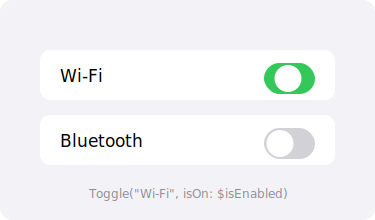

import PlaygroundLink from '@components/PlaygroundLink.astro';
import { Tabs, TabItem } from '@astrojs/starlight/components';

El componente `Toggle` permite al usuario alternar entre dos estados: activado y desactivado.

## Vista previa



## Uso básico

<Tabs syncKey="lang">
  <TabItem label="Swift">
    ```swift
    struct ToggleEjemplo: View {
        @State private var wifiActivo = true

        var body: some View {
            Toggle("Wi-Fi", isOn: $wifiActivo)
                .padding()
        }
    }
    ```
  </TabItem>
  <TabItem label="React">
    ```tsx
    "use client";

    import { useState } from "react";

    export default function ToggleEjemplo() {
      const [wifiActivo, setWifiActivo] = useState(true);

      return (
        <label className="flex items-center justify-between p-4">
          <span className="text-lg">Wi-Fi</span>
          <button
            role="switch"
            aria-checked={wifiActivo}
            onClick={() => setWifiActivo(!wifiActivo)}
            className={`relative w-12 h-7 rounded-full transition ${
              wifiActivo ? "bg-green-500" : "bg-gray-300"
            }`}
          >
            <span
              className={`absolute top-0.5 left-0.5 w-6 h-6 bg-white rounded-full shadow transition-transform ${
                wifiActivo ? "translate-x-5" : "translate-x-0"
              }`}
            />
          </button>
        </label>
      );
    }
    ```
  </TabItem>
</Tabs>

<PlaygroundLink />

## Toggle con label personalizado

<Tabs syncKey="lang">
  <TabItem label="Swift">
    ```swift
    Toggle(isOn: $modoOscuro) {
        HStack {
            Image(systemName: "moon.fill")
            Text("Modo oscuro")
        }
    }
    ```
  </TabItem>
  <TabItem label="React">
    ```tsx
    "use client";

    import { useState } from "react";
    import { MoonIcon } from "@heroicons/react/24/solid";

    export default function ToggleModoOscuro() {
      const [modoOscuro, setModoOscuro] = useState(false);

      return (
        <label className="flex items-center justify-between p-4">
          <span className="flex items-center gap-2">
            <MoonIcon className="w-5 h-5" />
            Modo oscuro
          </span>
          <button
            role="switch"
            aria-checked={modoOscuro}
            onClick={() => setModoOscuro(!modoOscuro)}
            className={`relative w-12 h-7 rounded-full transition ${
              modoOscuro ? "bg-green-500" : "bg-gray-300"
            }`}
          >
            <span
              className={`absolute top-0.5 left-0.5 w-6 h-6 bg-white rounded-full shadow transition-transform ${
                modoOscuro ? "translate-x-5" : "translate-x-0"
              }`}
            />
          </button>
        </label>
      );
    }
    ```
  </TabItem>
</Tabs>

<PlaygroundLink />

## Estilos de Toggle

<Tabs syncKey="lang">
  <TabItem label="Swift">
    ```swift
    VStack(spacing: 20) {
        // Estilo interruptor (por defecto)
        Toggle("Automático", isOn: $opcion1)
            .toggleStyle(.switch)

        // Estilo botón
        Toggle("Favorito", isOn: $opcion2)
            .toggleStyle(.button)
    }
    ```
  </TabItem>
  <TabItem label="React">
    ```tsx
    "use client";

    import { useState } from "react";

    export default function EstilosToggle() {
      const [opcion1, setOpcion1] = useState(false);
      const [opcion2, setOpcion2] = useState(false);

      return (
        <div className="flex flex-col gap-5 p-4">
          {/* Estilo interruptor */}
          <label className="flex items-center justify-between">
            <span>Automático</span>
            <button
              role="switch"
              aria-checked={opcion1}
              onClick={() => setOpcion1(!opcion1)}
              className={`relative w-12 h-7 rounded-full transition ${
                opcion1 ? "bg-green-500" : "bg-gray-300"
              }`}
            >
              <span
                className={`absolute top-0.5 left-0.5 w-6 h-6 bg-white rounded-full shadow transition-transform ${
                  opcion1 ? "translate-x-5" : "translate-x-0"
                }`}
              />
            </button>
          </label>

          {/* Estilo botón */}
          <button
            onClick={() => setOpcion2(!opcion2)}
            className={`px-4 py-2 rounded-lg border transition ${
              opcion2
                ? "bg-blue-500 text-white border-blue-500"
                : "bg-white text-gray-700 border-gray-300"
            }`}
          >
            Favorito
          </button>
        </div>
      );
    }
    ```
  </TabItem>
</Tabs>

<PlaygroundLink />

## Modificadores comunes

| Modificador | Descripción |
|---|---|
| `.toggleStyle(.switch)` | Estilo interruptor (por defecto) |
| `.toggleStyle(.button)` | Estilo botón |
| `.tint(.green)` | Color del toggle activado |
| `.disabled(true)` | Deshabilita el toggle |

:::tip
Usa `Toggle` dentro de un `Form` o `List` para obtener el estilo nativo de configuración de iOS.
:::

## Ejemplo completo

<Tabs syncKey="lang">
  <TabItem label="Swift">
    ```swift
    struct ConfiguracionView: View {
        @State private var notificaciones = true
        @State private var sonido = true
        @State private var modoOscuro = false
        @State private var ubicacion = false

        var body: some View {
            Form {
                Section("General") {
                    Toggle("Notificaciones", isOn: $notificaciones)
                    Toggle("Sonido", isOn: $sonido)
                }

                Section("Apariencia") {
                    Toggle("Modo oscuro", isOn: $modoOscuro)
                        .tint(.indigo)
                }

                Section("Privacidad") {
                    Toggle("Compartir ubicación", isOn: $ubicacion)
                        .tint(.orange)
                }
            }
        }
    }
    ```
  </TabItem>
  <TabItem label="React">
    ```tsx
    "use client";

    import { useState } from "react";

    function ToggleSwitch({
      label,
      checked,
      onChange,
      tint = "bg-green-500",
    }: {
      label: string;
      checked: boolean;
      onChange: (v: boolean) => void;
      tint?: string;
    }) {
      return (
        <label className="flex items-center justify-between py-3">
          <span>{label}</span>
          <button
            role="switch"
            aria-checked={checked}
            onClick={() => onChange(!checked)}
            className={`relative w-12 h-7 rounded-full transition ${
              checked ? tint : "bg-gray-300"
            }`}
          >
            <span
              className={`absolute top-0.5 left-0.5 w-6 h-6 bg-white rounded-full shadow transition-transform ${
                checked ? "translate-x-5" : "translate-x-0"
              }`}
            />
          </button>
        </label>
      );
    }

    export default function Configuracion() {
      const [notificaciones, setNotificaciones] = useState(true);
      const [sonido, setSonido] = useState(true);
      const [modoOscuro, setModoOscuro] = useState(false);
      const [ubicacion, setUbicacion] = useState(false);

      return (
        <div className="max-w-md mx-auto divide-y">
          <section className="py-4">
            <h3 className="text-sm font-semibold text-gray-500 uppercase mb-2">
              General
            </h3>
            <ToggleSwitch
              label="Notificaciones"
              checked={notificaciones}
              onChange={setNotificaciones}
            />
            <ToggleSwitch
              label="Sonido"
              checked={sonido}
              onChange={setSonido}
            />
          </section>

          <section className="py-4">
            <h3 className="text-sm font-semibold text-gray-500 uppercase mb-2">
              Apariencia
            </h3>
            <ToggleSwitch
              label="Modo oscuro"
              checked={modoOscuro}
              onChange={setModoOscuro}
              tint="bg-indigo-500"
            />
          </section>

          <section className="py-4">
            <h3 className="text-sm font-semibold text-gray-500 uppercase mb-2">
              Privacidad
            </h3>
            <ToggleSwitch
              label="Compartir ubicación"
              checked={ubicacion}
              onChange={setUbicacion}
              tint="bg-orange-500"
            />
          </section>
        </div>
      );
    }
    ```
  </TabItem>
</Tabs>

<PlaygroundLink />
