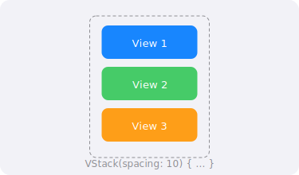

import PlaygroundLink from '@components/PlaygroundLink.astro';
import { Tabs, TabItem } from '@astrojs/starlight/components';

`VStack` (Vertical Stack) organiza sus vistas hijas en una columna vertical, de arriba hacia abajo.

## Vista previa



## Uso básico

<Tabs syncKey="lang">
  <TabItem label="Swift">
    ```swift
    VStack {
        Text("Primera línea")
        Text("Segunda línea")
        Text("Tercera línea")
    }
    ```
  </TabItem>
  <TabItem label="React">
    ```tsx
    <div className="flex flex-col">
      <p>Primera línea</p>
      <p>Segunda línea</p>
      <p>Tercera línea</p>
    </div>
    ```
  </TabItem>
</Tabs>

<PlaygroundLink />

## Espaciado

<Tabs syncKey="lang">
  <TabItem label="Swift">
    ```swift
    // Espaciado personalizado
    VStack(spacing: 20) {
        Text("Con espacio")
        Text("Entre elementos")
        Text("De 20 puntos")
    }

    // Sin espaciado
    VStack(spacing: 0) {
        Color.red.frame(height: 50)
        Color.green.frame(height: 50)
        Color.blue.frame(height: 50)
    }
    ```
  </TabItem>
  <TabItem label="React">
    ```tsx
    {/* Espaciado personalizado */}
    <div className="flex flex-col gap-5">
      <p>Con espacio</p>
      <p>Entre elementos</p>
      <p>De 20 puntos</p>
    </div>

    {/* Sin espaciado */}
    <div className="flex flex-col gap-0">
      <div className="h-[50px] bg-red-500" />
      <div className="h-[50px] bg-green-500" />
      <div className="h-[50px] bg-blue-500" />
    </div>
    ```
  </TabItem>
</Tabs>

<PlaygroundLink />

## Alineación

<Tabs syncKey="lang">
  <TabItem label="Swift">
    ```swift
    VStack(alignment: .leading) {
        Text("Título largo de ejemplo")
            .font(.title)
        Text("Subtítulo")
            .font(.subheadline)
        Text("Descripción corta")
            .font(.caption)
    }
    ```
  </TabItem>
  <TabItem label="React">
    ```tsx
    <div className="flex flex-col items-start">
      <h1 className="text-2xl font-bold">Título largo de ejemplo</h1>
      <p className="text-sm">Subtítulo</p>
      <p className="text-xs">Descripción corta</p>
    </div>
    ```
  </TabItem>
</Tabs>

<PlaygroundLink />

Opciones de alineación:
- `.leading` — Alinea a la izquierda
- `.center` — Centro (por defecto)
- `.trailing` — Alinea a la derecha

## Spacer

Usa `Spacer` para empujar elementos dentro del stack:

<Tabs syncKey="lang">
  <TabItem label="Swift">
    ```swift
    VStack {
        Text("Arriba")
        Spacer()
        Text("Abajo")
    }
    .frame(height: 300)
    ```
  </TabItem>
  <TabItem label="React">
    ```tsx
    <div className="flex flex-col h-[300px]">
      <p>Arriba</p>
      <div className="flex-1" />
      <p>Abajo</p>
    </div>
    ```
  </TabItem>
</Tabs>

<PlaygroundLink />

:::tip
Combina `VStack` con `HStack` y `ZStack` para crear layouts complejos. Es el patrón fundamental de composición en SwiftUI.
:::

## Ejemplo completo

<Tabs syncKey="lang">
  <TabItem label="Swift">
    ```swift
    struct PerfilView: View {
        var body: some View {
            VStack(spacing: 16) {
                // Avatar
                Image(systemName: "person.circle.fill")
                    .resizable()
                    .frame(width: 100, height: 100)
                    .foregroundStyle(.blue)

                // Información
                VStack(spacing: 4) {
                    Text("María García")
                        .font(.title2)
                        .bold()
                    Text("Desarrolladora iOS")
                        .font(.subheadline)
                        .foregroundStyle(.secondary)
                }

                // Estadísticas
                HStack(spacing: 40) {
                    VStack {
                        Text("128")
                            .font(.headline)
                        Text("Posts")
                            .font(.caption)
                            .foregroundStyle(.secondary)
                    }
                    VStack {
                        Text("1.2K")
                            .font(.headline)
                        Text("Seguidores")
                            .font(.caption)
                            .foregroundStyle(.secondary)
                    }
                    VStack {
                        Text("847")
                            .font(.headline)
                        Text("Siguiendo")
                            .font(.caption)
                            .foregroundStyle(.secondary)
                    }
                }

                Spacer()
            }
            .padding()
        }
    }
    ```
  </TabItem>
  <TabItem label="React">
    ```tsx
    function Perfil() {
      return (
        <div className="flex flex-col items-center gap-4 p-4">
          {/* Avatar */}
          <div className="w-[100px] h-[100px] rounded-full bg-blue-500 flex items-center justify-center">
            <span className="text-white text-4xl">👤</span>
          </div>

          {/* Información */}
          <div className="flex flex-col items-center gap-1">
            <h2 className="text-xl font-bold">María García</h2>
            <p className="text-sm text-gray-500">Desarrolladora iOS</p>
          </div>

          {/* Estadísticas */}
          <div className="flex flex-row gap-10">
            <div className="flex flex-col items-center">
              <span className="font-semibold">128</span>
              <span className="text-xs text-gray-500">Posts</span>
            </div>
            <div className="flex flex-col items-center">
              <span className="font-semibold">1.2K</span>
              <span className="text-xs text-gray-500">Seguidores</span>
            </div>
            <div className="flex flex-col items-center">
              <span className="font-semibold">847</span>
              <span className="text-xs text-gray-500">Siguiendo</span>
            </div>
          </div>

          <div className="flex-1" />
        </div>
      );
    }
    ```
  </TabItem>
</Tabs>

<PlaygroundLink />
