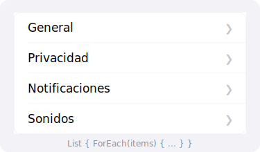

import PlaygroundLink from '@components/PlaygroundLink.astro';
import { Tabs, TabItem } from '@astrojs/starlight/components';

`List` muestra una colección de datos en filas desplazables, similar a `UITableView` en UIKit.

## Vista previa



## Uso básico

<Tabs syncKey="lang">
  <TabItem label="Swift">
    ```swift
    struct ListaEjemplo: View {
        let frutas = ["Manzana", "Plátano", "Naranja", "Uva", "Fresa"]

        var body: some View {
            List(frutas, id: \.self) { fruta in
                Text(fruta)
            }
        }
    }
    ```
  </TabItem>
  <TabItem label="React (Next.js)">
    ```tsx
    const frutas = ["Manzana", "Plátano", "Naranja", "Uva", "Fresa"];

    export default function ListaEjemplo() {
      return (
        <ul className="divide-y divide-gray-200 rounded-lg bg-white">
          {frutas.map((fruta) => (
            <li key={fruta} className="px-4 py-3 text-gray-800">
              {fruta}
            </li>
          ))}
        </ul>
      );
    }
    ```
  </TabItem>
</Tabs>

<PlaygroundLink />

## List con ForEach

<Tabs syncKey="lang">
  <TabItem label="Swift">
    ```swift
    struct Tarea: Identifiable {
        let id = UUID()
        var titulo: String
        var completada: Bool
    }

    struct TareasView: View {
        @State private var tareas = [
            Tarea(titulo: "Comprar leche", completada: true),
            Tarea(titulo: "Llamar al doctor", completada: false),
            Tarea(titulo: "Estudiar Swift", completada: false),
        ]

        var body: some View {
            List {
                ForEach(tareas) { tarea in
                    HStack {
                        Image(systemName: tarea.completada ? "checkmark.circle.fill" : "circle")
                            .foregroundStyle(tarea.completada ? .green : .gray)
                        Text(tarea.titulo)
                    }
                }
            }
        }
    }
    ```
  </TabItem>
  <TabItem label="React (Next.js)">
    ```tsx
    "use client";
    import { useState } from "react";

    interface Tarea {
      id: string;
      titulo: string;
      completada: boolean;
    }

    export default function TareasView() {
      const [tareas] = useState<Tarea[]>([
        { id: "1", titulo: "Comprar leche", completada: true },
        { id: "2", titulo: "Llamar al doctor", completada: false },
        { id: "3", titulo: "Estudiar Swift", completada: false },
      ]);

      return (
        <ul className="divide-y divide-gray-200 rounded-lg bg-white">
          {tareas.map((tarea) => (
            <li key={tarea.id} className="flex items-center gap-3 px-4 py-3">
              <span className={tarea.completada ? "text-green-500" : "text-gray-400"}>
                {tarea.completada ? "✔" : "○"}
              </span>
              <span>{tarea.titulo}</span>
            </li>
          ))}
        </ul>
      );
    }
    ```
  </TabItem>
</Tabs>

<PlaygroundLink />

## Secciones

<Tabs syncKey="lang">
  <TabItem label="Swift">
    ```swift
    List {
        Section("Frutas") {
            Text("Manzana")
            Text("Plátano")
        }

        Section("Verduras") {
            Text("Zanahoria")
            Text("Brócoli")
        }
    }
    ```
  </TabItem>
  <TabItem label="React (Next.js)">
    ```tsx
    const secciones = [
      { titulo: "Frutas", items: ["Manzana", "Plátano"] },
      { titulo: "Verduras", items: ["Zanahoria", "Brócoli"] },
    ];

    export default function ListaSecciones() {
      return (
        <div className="space-y-6">
          {secciones.map((seccion) => (
            <div key={seccion.titulo}>
              <h3 className="mb-2 text-sm font-semibold uppercase text-gray-500">
                {seccion.titulo}
              </h3>
              <ul className="divide-y divide-gray-200 rounded-lg bg-white">
                {seccion.items.map((item) => (
                  <li key={item} className="px-4 py-3 text-gray-800">
                    {item}
                  </li>
                ))}
              </ul>
            </div>
          ))}
        </div>
      );
    }
    ```
  </TabItem>
</Tabs>

<PlaygroundLink />

## Acciones de deslizamiento

<Tabs syncKey="lang">
  <TabItem label="Swift">
    ```swift
    List {
        ForEach(tareas) { tarea in
            Text(tarea.titulo)
                .swipeActions(edge: .trailing) {
                    Button(role: .destructive) {
                        // Eliminar
                    } label: {
                        Label("Eliminar", systemImage: "trash")
                    }
                }
                .swipeActions(edge: .leading) {
                    Button {
                        // Marcar como favorito
                    } label: {
                        Label("Favorito", systemImage: "star")
                    }
                    .tint(.yellow)
                }
        }
    }
    ```
  </TabItem>
  <TabItem label="React (Next.js)">
    ```tsx
    "use client";
    import { useState } from "react";

    interface Tarea {
      id: string;
      titulo: string;
    }

    export default function ListaConAcciones() {
      const [tareas, setTareas] = useState<Tarea[]>([
        { id: "1", titulo: "Comprar leche" },
        { id: "2", titulo: "Llamar al doctor" },
      ]);

      const eliminar = (id: string) =>
        setTareas((prev) => prev.filter((t) => t.id !== id));

      return (
        <ul className="divide-y divide-gray-200 rounded-lg bg-white">
          {tareas.map((tarea) => (
            <li key={tarea.id} className="flex items-center justify-between px-4 py-3">
              <span>{tarea.titulo}</span>
              <div className="flex gap-2">
                <button
                  onClick={() => alert("Favorito")}
                  className="rounded bg-yellow-400 px-2 py-1 text-xs text-white"
                >
                  ★
                </button>
                <button
                  onClick={() => eliminar(tarea.id)}
                  className="rounded bg-red-500 px-2 py-1 text-xs text-white"
                >
                  Eliminar
                </button>
              </div>
            </li>
          ))}
        </ul>
      );
    }
    ```
  </TabItem>
</Tabs>

<PlaygroundLink />

## Estilos de lista

| Estilo | Descripción |
|---|---|
| `.listStyle(.automatic)` | Estilo por defecto |
| `.listStyle(.plain)` | Sin separadores de grupo |
| `.listStyle(.grouped)` | Agrupado con fondo |
| `.listStyle(.insetGrouped)` | Agrupado con márgenes |
| `.listStyle(.sidebar)` | Estilo barra lateral |

:::tip
Usa `List` con `@State` y `.onDelete` para crear listas editables donde el usuario puede eliminar filas deslizando.
:::

## Ejemplo completo

<Tabs syncKey="lang">
  <TabItem label="Swift">
    ```swift
    struct ContactosView: View {
        @State private var contactos = [
            "Ana López", "Carlos Ruiz", "Diana Flores",
            "Eduardo Paz", "Fernanda Gil", "Gustavo Mora"
        ]
        @State private var busqueda = ""

        var contactosFiltrados: [String] {
            if busqueda.isEmpty {
                return contactos
            }
            return contactos.filter { $0.localizedCaseInsensitiveContains(busqueda) }
        }

        var body: some View {
            NavigationStack {
                List {
                    ForEach(contactosFiltrados, id: \.self) { contacto in
                        HStack {
                            Image(systemName: "person.circle.fill")
                                .foregroundStyle(.blue)
                                .font(.title2)
                            Text(contacto)
                        }
                    }
                    .onDelete { indices in
                        contactos.remove(atOffsets: indices)
                    }
                }
                .navigationTitle("Contactos")
                .searchable(text: $busqueda, prompt: "Buscar contacto")
                .toolbar {
                    EditButton()
                }
            }
        }
    }
    ```
  </TabItem>
  <TabItem label="React (Next.js)">
    ```tsx
    "use client";
    import { useState } from "react";

    const contactosIniciales = [
      "Ana López", "Carlos Ruiz", "Diana Flores",
      "Eduardo Paz", "Fernanda Gil", "Gustavo Mora",
    ];

    export default function ContactosView() {
      const [contactos, setContactos] = useState(contactosIniciales);
      const [busqueda, setBusqueda] = useState("");

      const contactosFiltrados = contactos.filter((c) =>
        c.toLowerCase().includes(busqueda.toLowerCase())
      );

      const eliminar = (nombre: string) =>
        setContactos((prev) => prev.filter((c) => c !== nombre));

      return (
        <div className="mx-auto max-w-md">
          <h1 className="mb-4 text-2xl font-bold">Contactos</h1>
          <input
            type="text"
            placeholder="Buscar contacto"
            value={busqueda}
            onChange={(e) => setBusqueda(e.target.value)}
            className="mb-4 w-full rounded-lg border px-4 py-2"
          />
          <ul className="divide-y divide-gray-200 rounded-lg bg-white">
            {contactosFiltrados.map((contacto) => (
              <li key={contacto} className="flex items-center justify-between px-4 py-3">
                <div className="flex items-center gap-3">
                  <span className="text-2xl text-blue-500">👤</span>
                  <span>{contacto}</span>
                </div>
                <button
                  onClick={() => eliminar(contacto)}
                  className="text-sm text-red-500 hover:text-red-700"
                >
                  Eliminar
                </button>
              </li>
            ))}
          </ul>
        </div>
      );
    }
    ```
  </TabItem>
</Tabs>

<PlaygroundLink />
