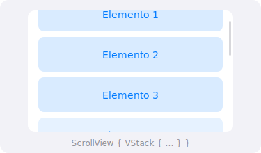

`ScrollView` permite crear áreas de contenido que se pueden desplazar cuando el contenido excede el espacio disponible.

## Vista previa



## Uso básico (vertical)

```swift
ScrollView {
    VStack(spacing: 20) {
        ForEach(0..<20) { i in
            Text("Elemento \(i)")
                .frame(maxWidth: .infinity)
                .padding()
                .background(Color.blue.opacity(0.1))
                .cornerRadius(10)
        }
    }
    .padding()
}
```

> [Probar en Swift Playground →](https://swiftfiddle.com/)

## ScrollView horizontal

```swift
ScrollView(.horizontal, showsIndicators: false) {
    HStack(spacing: 16) {
        ForEach(0..<10) { i in
            RoundedRectangle(cornerRadius: 12)
                .fill(Color.purple.opacity(0.3))
                .frame(width: 150, height: 200)
                .overlay(
                    Text("Tarjeta \(i)")
                        .font(.headline)
                )
        }
    }
    .padding()
}
```

> [Probar en Swift Playground →](https://swiftfiddle.com/)

## ScrollViewReader

Permite desplazarse programáticamente a una vista específica:

```swift
struct ScrollConBotonView: View {
    var body: some View {
        ScrollViewReader { proxy in
            VStack {
                Button("Ir al final") {
                    withAnimation {
                        proxy.scrollTo("ultimo", anchor: .bottom)
                    }
                }

                ScrollView {
                    ForEach(0..<50) { i in
                        Text("Fila \(i)")
                            .id(i)
                            .padding()
                    }
                    Text("Final de la lista")
                        .id("ultimo")
                }
            }
        }
    }
}
```

> [Probar en Swift Playground →](https://swiftfiddle.com/)

## Modificadores comunes

| Modificador | Descripción |
|---|---|
| `.horizontal` | Dirección horizontal |
| `.vertical` | Dirección vertical (por defecto) |
| `showsIndicators: false` | Oculta indicadores de scroll |
| `.scrollTargetLayout()` | Habilita paginación |

:::tip
Usa `LazyVStack` o `LazyHStack` dentro de `ScrollView` para mejorar el rendimiento con muchos elementos. Los elementos lazy solo se crean cuando son visibles.
:::

## Ejemplo completo

```swift
struct GaleriaView: View {
    let categorias = ["Recientes", "Favoritos", "Compartidos"]

    var body: some View {
        ScrollView {
            VStack(alignment: .leading, spacing: 24) {
                ForEach(categorias, id: \.self) { categoria in
                    VStack(alignment: .leading) {
                        Text(categoria)
                            .font(.title2)
                            .bold()
                            .padding(.horizontal)

                        ScrollView(.horizontal, showsIndicators: false) {
                            HStack(spacing: 12) {
                                ForEach(0..<8) { i in
                                    VStack {
                                        RoundedRectangle(cornerRadius: 12)
                                            .fill(Color.accentColor.opacity(0.2))
                                            .frame(width: 120, height: 120)
                                            .overlay(
                                                Image(systemName: "photo")
                                                    .font(.largeTitle)
                                                    .foregroundColor(.accentColor)
                                            )
                                        Text("Foto \(i + 1)")
                                            .font(.caption)
                                    }
                                }
                            }
                            .padding(.horizontal)
                        }
                    }
                }
            }
            .padding(.vertical)
        }
    }
}
```

> [Probar en Swift Playground →](https://swiftfiddle.com/)
