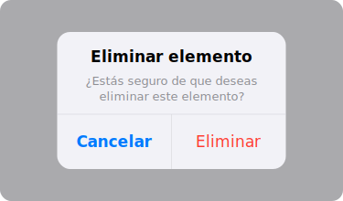

import PlaygroundLink from '@components/PlaygroundLink.astro';
import { Tabs, TabItem } from '@astrojs/starlight/components';

El modificador `.alert` muestra un diálogo de alerta sobre el contenido actual. Es útil para confirmar acciones importantes o notificar al usuario.

## Vista previa



## Uso básico

<Tabs syncKey="lang">
  <TabItem label="Swift">
    ```swift
    struct AlertEjemplo: View {
        @State private var mostrarAlerta = false

        var body: some View {
            Button("Eliminar") {
                mostrarAlerta = true
            }
            .alert("¿Eliminar elemento?", isPresented: $mostrarAlerta) {
                Button("Cancelar", role: .cancel) { }
                Button("Eliminar", role: .destructive) {
                    // Realizar eliminación
                }
            } message: {
                Text("Esta acción no se puede deshacer.")
            }
        }
    }
    ```
  </TabItem>
  <TabItem label="React">
    ```tsx
    "use client";
    import { useState } from "react";

    export default function AlertEjemplo() {
      const [mostrarAlerta, setMostrarAlerta] = useState(false);

      return (
        <>
          <button
            onClick={() => setMostrarAlerta(true)}
            className="px-4 py-2 bg-red-500 text-white rounded-lg"
          >
            Eliminar
          </button>

          {mostrarAlerta && (
            <div className="fixed inset-0 z-50 flex items-center justify-center bg-black/40">
              <div className="w-72 rounded-2xl bg-white p-6 text-center shadow-xl">
                <h3 className="text-lg font-semibold">¿Eliminar elemento?</h3>
                <p className="mt-1 text-sm text-gray-500">
                  Esta acción no se puede deshacer.
                </p>
                <div className="mt-4 flex gap-3">
                  <button
                    onClick={() => setMostrarAlerta(false)}
                    className="flex-1 rounded-lg border px-4 py-2 font-medium"
                  >
                    Cancelar
                  </button>
                  <button
                    onClick={() => {
                      // Realizar eliminación
                      setMostrarAlerta(false);
                    }}
                    className="flex-1 rounded-lg bg-red-500 px-4 py-2 font-medium text-white"
                  >
                    Eliminar
                  </button>
                </div>
              </div>
            </div>
          )}
        </>
      );
    }
    ```
  </TabItem>
</Tabs>

<PlaygroundLink />

## Alerta simple

<Tabs syncKey="lang">
  <TabItem label="Swift">
    ```swift
    .alert("Guardado exitosamente", isPresented: $mostrar) {
        Button("OK") { }
    }
    ```
  </TabItem>
  <TabItem label="React">
    ```tsx
    {mostrar && (
      <div className="fixed inset-0 z-50 flex items-center justify-center bg-black/40">
        <div className="w-72 rounded-2xl bg-white p-6 text-center shadow-xl">
          <h3 className="text-lg font-semibold">Guardado exitosamente</h3>
          <button
            onClick={() => setMostrar(false)}
            className="mt-4 w-full rounded-lg bg-blue-500 px-4 py-2 font-medium text-white"
          >
            OK
          </button>
        </div>
      </div>
    )}
    ```
  </TabItem>
</Tabs>

<PlaygroundLink />

## Alerta con TextField

<Tabs syncKey="lang">
  <TabItem label="Swift">
    ```swift
    @State private var nombre = ""
    @State private var mostrar = false

    Button("Cambiar nombre") { mostrar = true }
    .alert("Nuevo nombre", isPresented: $mostrar) {
        TextField("Nombre", text: $nombre)
        Button("Cancelar", role: .cancel) { }
        Button("Guardar") {
            // Guardar nombre
        }
    }
    ```
  </TabItem>
  <TabItem label="React">
    ```tsx
    "use client";
    import { useState } from "react";

    export default function AlertConInput() {
      const [nombre, setNombre] = useState("");
      const [mostrar, setMostrar] = useState(false);

      return (
        <>
          <button
            onClick={() => setMostrar(true)}
            className="px-4 py-2 bg-blue-500 text-white rounded-lg"
          >
            Cambiar nombre
          </button>

          {mostrar && (
            <div className="fixed inset-0 z-50 flex items-center justify-center bg-black/40">
              <div className="w-72 rounded-2xl bg-white p-6 shadow-xl">
                <h3 className="text-lg font-semibold">Nuevo nombre</h3>
                <input
                  value={nombre}
                  onChange={(e) => setNombre(e.target.value)}
                  placeholder="Nombre"
                  className="mt-3 w-full rounded-lg border px-3 py-2 focus:outline-none focus:ring-2 focus:ring-blue-500"
                />
                <div className="mt-4 flex gap-3">
                  <button
                    onClick={() => setMostrar(false)}
                    className="flex-1 rounded-lg border px-4 py-2 font-medium"
                  >
                    Cancelar
                  </button>
                  <button
                    onClick={() => {
                      // Guardar nombre
                      setMostrar(false);
                    }}
                    className="flex-1 rounded-lg bg-blue-500 px-4 py-2 font-medium text-white"
                  >
                    Guardar
                  </button>
                </div>
              </div>
            </div>
          )}
        </>
      );
    }
    ```
  </TabItem>
</Tabs>

<PlaygroundLink />

## Alerta con datos

<Tabs syncKey="lang">
  <TabItem label="Swift">
    ```swift
    struct Error: Identifiable {
        let id = UUID()
        let mensaje: String
    }

    @State private var error: Error?

    // Se muestra automáticamente cuando error != nil
    .alert(item: $error) { err in
        Alert(
            title: Text("Error"),
            message: Text(err.mensaje),
            dismissButton: .default(Text("OK"))
        )
    }
    ```
  </TabItem>
  <TabItem label="React">
    ```tsx
    "use client";
    import { useState } from "react";

    interface AppError {
      id: string;
      mensaje: string;
    }

    export default function AlertConDatos() {
      const [error, setError] = useState<AppError | null>(null);

      return (
        <>
          {/* Se muestra automáticamente cuando error !== null */}
          {error && (
            <div className="fixed inset-0 z-50 flex items-center justify-center bg-black/40">
              <div className="w-72 rounded-2xl bg-white p-6 text-center shadow-xl">
                <h3 className="text-lg font-semibold">Error</h3>
                <p className="mt-1 text-sm text-gray-500">{error.mensaje}</p>
                <button
                  onClick={() => setError(null)}
                  className="mt-4 w-full rounded-lg bg-blue-500 px-4 py-2 font-medium text-white"
                >
                  OK
                </button>
              </div>
            </div>
          )}
        </>
      );
    }
    ```
  </TabItem>
</Tabs>

<PlaygroundLink />

:::caution
Las alertas interrumpen el flujo del usuario. Úsalas solo para acciones importantes o irreversibles. Para notificaciones informativas, considera usar un banner o toast.
:::

## Ejemplo completo

<Tabs syncKey="lang">
  <TabItem label="Swift">
    ```swift
    struct ListaTareasView: View {
        @State private var tareas = ["Comprar leche", "Estudiar Swift", "Hacer ejercicio"]
        @State private var mostrarEliminar = false
        @State private var indiceEliminar: IndexSet?
        @State private var mostrarExito = false

        var body: some View {
            NavigationStack {
                List {
                    ForEach(tareas, id: \.self) { tarea in
                        Text(tarea)
                    }
                    .onDelete { indices in
                        indiceEliminar = indices
                        mostrarEliminar = true
                    }
                }
                .navigationTitle("Tareas")
                .toolbar {
                    Button("Completar todas") {
                        mostrarExito = true
                    }
                }
                .alert("¿Eliminar tarea?", isPresented: $mostrarEliminar) {
                    Button("Cancelar", role: .cancel) {
                        indiceEliminar = nil
                    }
                    Button("Eliminar", role: .destructive) {
                        if let indices = indiceEliminar {
                            tareas.remove(atOffsets: indices)
                        }
                    }
                } message: {
                    Text("No podrás recuperar esta tarea.")
                }
                .alert("¡Felicidades!", isPresented: $mostrarExito) {
                    Button("OK") { }
                } message: {
                    Text("Has completado todas tus tareas del día.")
                }
            }
        }
    }
    ```
  </TabItem>
  <TabItem label="React">
    ```tsx
    "use client";
    import { useState } from "react";

    export default function ListaTareasView() {
      const [tareas, setTareas] = useState([
        "Comprar leche",
        "Estudiar Swift",
        "Hacer ejercicio",
      ]);
      const [indiceEliminar, setIndiceEliminar] = useState<number | null>(null);
      const [mostrarExito, setMostrarExito] = useState(false);

      function eliminarTarea() {
        if (indiceEliminar !== null) {
          setTareas(tareas.filter((_, i) => i !== indiceEliminar));
          setIndiceEliminar(null);
        }
      }

      return (
        <div className="mx-auto max-w-lg">
          <div className="flex items-center justify-between border-b px-4 py-3">
            <h1 className="text-xl font-bold">Tareas</h1>
            <button
              onClick={() => setMostrarExito(true)}
              className="text-blue-500 font-medium"
            >
              Completar todas
            </button>
          </div>

          <ul className="divide-y">
            {tareas.map((tarea, i) => (
              <li key={i} className="flex items-center justify-between px-4 py-3">
                <span>{tarea}</span>
                <button
                  onClick={() => setIndiceEliminar(i)}
                  className="text-red-500 text-sm"
                >
                  Eliminar
                </button>
              </li>
            ))}
          </ul>

          {/* Alerta de confirmación de eliminación */}
          {indiceEliminar !== null && (
            <div className="fixed inset-0 z-50 flex items-center justify-center bg-black/40">
              <div className="w-72 rounded-2xl bg-white p-6 text-center shadow-xl">
                <h3 className="text-lg font-semibold">¿Eliminar tarea?</h3>
                <p className="mt-1 text-sm text-gray-500">
                  No podrás recuperar esta tarea.
                </p>
                <div className="mt-4 flex gap-3">
                  <button
                    onClick={() => setIndiceEliminar(null)}
                    className="flex-1 rounded-lg border px-4 py-2 font-medium"
                  >
                    Cancelar
                  </button>
                  <button
                    onClick={eliminarTarea}
                    className="flex-1 rounded-lg bg-red-500 px-4 py-2 font-medium text-white"
                  >
                    Eliminar
                  </button>
                </div>
              </div>
            </div>
          )}

          {/* Alerta de éxito */}
          {mostrarExito && (
            <div className="fixed inset-0 z-50 flex items-center justify-center bg-black/40">
              <div className="w-72 rounded-2xl bg-white p-6 text-center shadow-xl">
                <h3 className="text-lg font-semibold">¡Felicidades!</h3>
                <p className="mt-1 text-sm text-gray-500">
                  Has completado todas tus tareas del día.
                </p>
                <button
                  onClick={() => setMostrarExito(false)}
                  className="mt-4 w-full rounded-lg bg-blue-500 px-4 py-2 font-medium text-white"
                >
                  OK
                </button>
              </div>
            </div>
          )}
        </div>
      );
    }
    ```
  </TabItem>
</Tabs>

<PlaygroundLink />
