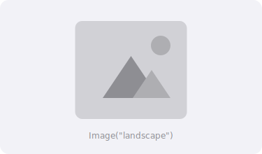

## El componente Image

`Image` muestra imágenes en SwiftUI. Puede cargar imágenes desde los assets del proyecto, SF Symbols del sistema, o incluso imágenes generadas programáticamente.



## Imágenes del sistema (SF Symbols)

```swift
import SwiftUI

struct ImagenSistema: View {
    var body: some View {
        VStack(spacing: 20) {
            Image(systemName: "star.fill")
            Image(systemName: "heart.fill")
            Image(systemName: "bell.badge.fill")
            Image(systemName: "person.crop.circle")
        }
        .font(.largeTitle)
    }
}
```

> [Probar en Swift Playground →](https://swiftfiddle.com/)

## Personalizar iconos del sistema

```swift
import SwiftUI

struct ImagenSistemaEstilos: View {
    var body: some View {
        VStack(spacing: 20) {
            // Cambiar tamaño con font
            Image(systemName: "cloud.sun.fill")
                .font(.system(size: 50))

            // Colores
            Image(systemName: "heart.fill")
                .font(.system(size: 40))
                .foregroundStyle(.red)

            // Peso del símbolo
            HStack(spacing: 20) {
                Image(systemName: "wifi")
                    .fontWeight(.ultraLight)
                Image(systemName: "wifi")
                    .fontWeight(.regular)
                Image(systemName: "wifi")
                    .fontWeight(.bold)
            }
            .font(.system(size: 30))

            // Rendering multicolor
            Image(systemName: "cloud.sun.rain.fill")
                .symbolRenderingMode(.multicolor)
                .font(.system(size: 60))
        }
    }
}
```

> [Probar en Swift Playground →](https://swiftfiddle.com/)

## Imágenes desde Assets

```swift
import SwiftUI

struct ImagenAssets: View {
    var body: some View {
        VStack(spacing: 20) {
            // Cargar imagen del catálogo de assets
            Image("miImagen")

            // Con modificadores
            Image("paisaje")
                .resizable()
                .aspectRatio(contentMode: .fit)
                .frame(width: 300, height: 200)
        }
    }
}
```

> [Probar en Swift Playground →](https://swiftfiddle.com/)

## Resizable y aspectRatio

Por defecto, las imágenes se muestran a su tamaño original. Usa `resizable()` para permitir que se ajusten.

```swift
import SwiftUI

struct ImagenRedimensionable: View {
    var body: some View {
        VStack(spacing: 20) {
            // .fit: la imagen completa cabe dentro del frame
            Image(systemName: "photo.fill")
                .resizable()
                .aspectRatio(contentMode: .fit)
                .frame(width: 150, height: 150)
                .background(Color.gray.opacity(0.2))

            // .fill: la imagen llena todo el frame (puede recortarse)
            Image(systemName: "photo.fill")
                .resizable()
                .aspectRatio(contentMode: .fill)
                .frame(width: 150, height: 100)
                .clipped()  // Recorta lo que sobresale
                .background(Color.gray.opacity(0.2))

            // Escalar a un tamaño específico
            Image(systemName: "globe")
                .resizable()
                .scaledToFit()
                .frame(width: 80, height: 80)
                .foregroundStyle(.blue)
        }
    }
}
```

> [Probar en Swift Playground →](https://swiftfiddle.com/)

:::tip
Siempre agrega `.resizable()` antes de `.frame()` cuando quieras cambiar el tamaño de una imagen. Sin `resizable()`, el frame no afectará el tamaño de la imagen.
:::

## Frame y alineación

```swift
import SwiftUI

struct ImagenFrame: View {
    var body: some View {
        VStack(spacing: 20) {
            // Frame con tamaño fijo
            Image(systemName: "star.fill")
                .resizable()
                .frame(width: 50, height: 50)
                .foregroundStyle(.yellow)

            // Frame con tamaño máximo
            Image(systemName: "rectangle.fill")
                .resizable()
                .aspectRatio(contentMode: .fit)
                .frame(maxWidth: 200, maxHeight: 100)
                .foregroundStyle(.blue)
        }
    }
}
```

> [Probar en Swift Playground →](https://swiftfiddle.com/)

## Recortar imágenes

```swift
import SwiftUI

struct ImagenRecorte: View {
    var body: some View {
        VStack(spacing: 20) {
            // Recorte circular
            Image(systemName: "person.fill")
                .resizable()
                .scaledToFill()
                .frame(width: 100, height: 100)
                .clipShape(Circle())
                .overlay(Circle().stroke(Color.blue, lineWidth: 3))

            // Recorte con esquinas redondeadas
            Image(systemName: "photo.fill")
                .resizable()
                .scaledToFill()
                .frame(width: 150, height: 100)
                .clipShape(RoundedRectangle(cornerRadius: 16))

            // Recorte con cápsula
            Image(systemName: "photo.fill")
                .resizable()
                .scaledToFill()
                .frame(width: 200, height: 80)
                .clipShape(Capsule())
        }
        .foregroundStyle(.gray)
    }
}
```

> [Probar en Swift Playground →](https://swiftfiddle.com/)

## Sombra y borde

```swift
import SwiftUI

struct ImagenEfectos: View {
    var body: some View {
        VStack(spacing: 30) {
            // Sombra
            Image(systemName: "heart.fill")
                .resizable()
                .frame(width: 60, height: 60)
                .foregroundStyle(.red)
                .shadow(color: .red.opacity(0.5), radius: 10, x: 0, y: 5)

            // Borde con overlay
            Image(systemName: "person.crop.circle")
                .resizable()
                .frame(width: 80, height: 80)
                .foregroundStyle(.blue)
                .overlay(
                    Circle()
                        .stroke(Color.blue, lineWidth: 3)
                )

            // Opacidad
            Image(systemName: "sun.max.fill")
                .resizable()
                .frame(width: 60, height: 60)
                .foregroundStyle(.orange)
                .opacity(0.5)
        }
    }
}
```

> [Probar en Swift Playground →](https://swiftfiddle.com/)

## AsyncImage (iOS 15+)

Carga imágenes de forma asíncrona desde una URL.

```swift
import SwiftUI

struct ImagenAsincrona: View {
    var body: some View {
        VStack(spacing: 20) {
            // Uso básico
            AsyncImage(url: URL(string: "https://picsum.photos/200"))

            // Con placeholder y fases
            AsyncImage(url: URL(string: "https://picsum.photos/300")) { fase in
                switch fase {
                case .empty:
                    ProgressView()
                        .frame(width: 150, height: 150)
                case .success(let imagen):
                    imagen
                        .resizable()
                        .scaledToFit()
                        .frame(width: 150, height: 150)
                        .clipShape(RoundedRectangle(cornerRadius: 12))
                case .failure:
                    Image(systemName: "exclamationmark.triangle")
                        .font(.largeTitle)
                        .foregroundStyle(.red)
                @unknown default:
                    EmptyView()
                }
            }
        }
    }
}
```

> [Probar en Swift Playground →](https://swiftfiddle.com/)

## Resumen

| Modificador | Uso |
|-------------|-----|
| `.resizable()` | Permite redimensionar la imagen |
| `.scaledToFit()` | Ajusta manteniendo proporción |
| `.scaledToFill()` | Llena el espacio disponible |
| `.frame(width:height:)` | Tamaño específico |
| `.clipShape()` | Recorta con una forma |
| `.shadow()` | Agrega sombra |
| `AsyncImage` | Carga desde URL |
