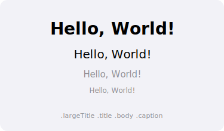

import PlaygroundLink from '@components/PlaygroundLink.astro';
import { Tabs, TabItem } from '@astrojs/starlight/components';

## El componente Text

`Text` es la vista fundamental para mostrar texto en SwiftUI. Soporta una amplia variedad de modificadores para personalizar la apariencia del texto.



## Uso básico

<Tabs syncKey="lang">
  <TabItem label="Swift">
    ```swift
    import SwiftUI

    struct TextoBasico: View {
        var body: some View {
            VStack(spacing: 12) {
                Text("Hola, mundo")
                Text("Un número: \(42)")
                Text("Fecha: \(Date(), style: .date)")
            }
        }
    }
    ```
  </TabItem>
  <TabItem label="React">
    ```tsx
    export default function TextoBasico() {
      return (
        <div className="flex flex-col gap-3">
          <p>Hola, mundo</p>
          <p>Un número: {42}</p>
          <p>Fecha: {new Date().toLocaleDateString("es-ES")}</p>
        </div>
      );
    }
    ```
  </TabItem>
</Tabs>

<PlaygroundLink />

## Modificadores de fuente

<Tabs syncKey="lang">
  <TabItem label="Swift">
    ```swift
    import SwiftUI

    struct TextoFuentes: View {
        var body: some View {
            VStack(alignment: .leading, spacing: 8) {
                Text("Large Title").font(.largeTitle)
                Text("Title").font(.title)
                Text("Title 2").font(.title2)
                Text("Title 3").font(.title3)
                Text("Headline").font(.headline)
                Text("Subheadline").font(.subheadline)
                Text("Body").font(.body)
                Text("Callout").font(.callout)
                Text("Caption").font(.caption)
                Text("Footnote").font(.footnote)
            }
        }
    }
    ```
  </TabItem>
  <TabItem label="React">
    ```tsx
    export default function TextoFuentes() {
      return (
        <div className="flex flex-col items-start gap-2">
          <p className="text-4xl font-bold">Large Title</p>
          <p className="text-3xl font-bold">Title</p>
          <p className="text-2xl font-bold">Title 2</p>
          <p className="text-xl font-semibold">Title 3</p>
          <p className="text-base font-semibold">Headline</p>
          <p className="text-sm">Subheadline</p>
          <p className="text-base">Body</p>
          <p className="text-sm">Callout</p>
          <p className="text-xs">Caption</p>
          <p className="text-xs text-gray-500">Footnote</p>
        </div>
      );
    }
    ```
  </TabItem>
</Tabs>

<PlaygroundLink />

## Fuente personalizada

<Tabs syncKey="lang">
  <TabItem label="Swift">
    ```swift
    import SwiftUI

    struct TextoPersonalizado: View {
        var body: some View {
            VStack(spacing: 12) {
                // Sistema con tamaño específico
                Text("Tamaño personalizado")
                    .font(.system(size: 24, weight: .bold, design: .rounded))

                // Fuente monoespaciada
                Text("Código fuente")
                    .font(.system(.body, design: .monospaced))

                // Fuente serif
                Text("Texto elegante")
                    .font(.system(.title, design: .serif))
            }
        }
    }
    ```
  </TabItem>
  <TabItem label="React">
    ```tsx
    export default function TextoPersonalizado() {
      return (
        <div className="flex flex-col gap-3">
          <p
            className="text-2xl font-bold"
            style={{ fontFamily: "ui-rounded, system-ui" }}
          >
            Tamaño personalizado
          </p>
          <p className="font-mono">Código fuente</p>
          <p className="text-2xl font-serif">Texto elegante</p>
        </div>
      );
    }
    ```
  </TabItem>
</Tabs>

<PlaygroundLink />

## Estilo de texto

<Tabs syncKey="lang">
  <TabItem label="Swift">
    ```swift
    import SwiftUI

    struct TextoEstilo: View {
        var body: some View {
            VStack(spacing: 12) {
                Text("Negrita")
                    .bold()

                Text("Cursiva")
                    .italic()

                Text("Subrayado")
                    .underline()

                Text("Tachado")
                    .strikethrough()

                Text("Negrita y cursiva")
                    .bold()
                    .italic()

                Text("Subrayado con color")
                    .underline(true, color: .red)

                Text("Tachado con estilo")
                    .strikethrough(true, color: .blue)
            }
        }
    }
    ```
  </TabItem>
  <TabItem label="React">
    ```tsx
    export default function TextoEstilo() {
      return (
        <div className="flex flex-col gap-3">
          <p className="font-bold">Negrita</p>
          <p className="italic">Cursiva</p>
          <p className="underline">Subrayado</p>
          <p className="line-through">Tachado</p>
          <p className="font-bold italic">Negrita y cursiva</p>
          <p className="underline decoration-red-500">Subrayado con color</p>
          <p className="line-through decoration-blue-500">Tachado con estilo</p>
        </div>
      );
    }
    ```
  </TabItem>
</Tabs>

<PlaygroundLink />

## Color del texto

<Tabs syncKey="lang">
  <TabItem label="Swift">
    ```swift
    import SwiftUI

    struct TextoColor: View {
        var body: some View {
            VStack(spacing: 12) {
                Text("Color primario")
                    .foregroundStyle(.primary)

                Text("Color secundario")
                    .foregroundStyle(.secondary)

                Text("Rojo")
                    .foregroundStyle(.red)

                Text("Azul")
                    .foregroundStyle(.blue)

                // Gradiente como color (iOS 16+)
                Text("Texto con gradiente")
                    .font(.title)
                    .foregroundStyle(
                        .linearGradient(
                            colors: [.blue, .purple],
                            startPoint: .leading,
                            endPoint: .trailing
                        )
                    )
            }
        }
    }
    ```
  </TabItem>
  <TabItem label="React">
    ```tsx
    export default function TextoColor() {
      return (
        <div className="flex flex-col gap-3">
          <p className="text-gray-900 dark:text-gray-100">Color primario</p>
          <p className="text-gray-500 dark:text-gray-400">Color secundario</p>
          <p className="text-red-500">Rojo</p>
          <p className="text-blue-500">Azul</p>
          <p className="text-2xl bg-gradient-to-r from-blue-500 to-purple-500 bg-clip-text text-transparent">
            Texto con gradiente
          </p>
        </div>
      );
    }
    ```
  </TabItem>
</Tabs>

<PlaygroundLink />

## Alineación de texto multilínea

<Tabs syncKey="lang">
  <TabItem label="Swift">
    ```swift
    import SwiftUI

    struct TextoMultilinea: View {
        let parrafo = "SwiftUI es un framework declarativo que permite construir interfaces de usuario de manera intuitiva y eficiente para todas las plataformas de Apple."

        var body: some View {
            VStack(spacing: 20) {
                Text(parrafo)
                    .multilineTextAlignment(.leading)
                    .frame(width: 200)

                Text(parrafo)
                    .multilineTextAlignment(.center)
                    .frame(width: 200)

                Text(parrafo)
                    .multilineTextAlignment(.trailing)
                    .frame(width: 200)
            }
        }
    }
    ```
  </TabItem>
  <TabItem label="React">
    ```tsx
    export default function TextoMultilinea() {
      const parrafo =
        "SwiftUI es un framework declarativo que permite construir interfaces de usuario de manera intuitiva y eficiente para todas las plataformas de Apple.";

      return (
        <div className="flex flex-col gap-5">
          <p className="w-48 text-left">{parrafo}</p>
          <p className="w-48 text-center">{parrafo}</p>
          <p className="w-48 text-right">{parrafo}</p>
        </div>
      );
    }
    ```
  </TabItem>
</Tabs>

<PlaygroundLink />

## Limitar líneas y truncamiento

<Tabs syncKey="lang">
  <TabItem label="Swift">
    ```swift
    import SwiftUI

    struct TextoLimites: View {
        let textoLargo = "Este es un texto muy largo que probablemente no cabrá en una sola línea y necesitará ser truncado de alguna manera."

        var body: some View {
            VStack(spacing: 16) {
                // Limitar a 1 línea
                Text(textoLargo)
                    .lineLimit(1)

                // Limitar a 2 líneas
                Text(textoLargo)
                    .lineLimit(2)

                // Truncar al inicio
                Text(textoLargo)
                    .lineLimit(1)
                    .truncationMode(.head)

                // Truncar en el medio
                Text(textoLargo)
                    .lineLimit(1)
                    .truncationMode(.middle)
            }
            .padding()
        }
    }
    ```
  </TabItem>
  <TabItem label="React">
    ```tsx
    export default function TextoLimites() {
      const textoLargo =
        "Este es un texto muy largo que probablemente no cabrá en una sola línea y necesitará ser truncado de alguna manera.";

      return (
        <div className="flex flex-col gap-4 p-4">
          {/* Limitar a 1 línea */}
          <p className="truncate">{textoLargo}</p>
          {/* Limitar a 2 líneas */}
          <p className="line-clamp-2">{textoLargo}</p>
          {/* CSS nativo solo soporta truncamiento al final */}
          <p className="w-64 truncate">{textoLargo}</p>
        </div>
      );
    }
    ```
  </TabItem>
</Tabs>

<PlaygroundLink />

## Combinar textos

<Tabs syncKey="lang">
  <TabItem label="Swift">
    ```swift
    import SwiftUI

    struct TextoCombinado: View {
        var body: some View {
            VStack(spacing: 16) {
                // Concatenar con +
                Text("Hola, ")
                    .font(.title) +
                Text("mundo")
                    .font(.title)
                    .foregroundStyle(.blue)
                    .bold() +
                Text("!")
                    .font(.title)
                    .foregroundStyle(.red)

                // Markdown integrado (iOS 15+)
                Text("Texto con **negrita**, *cursiva* y [enlace](https://swift.org)")
            }
            .padding()
        }
    }
    ```
  </TabItem>
  <TabItem label="React">
    ```tsx
    export default function TextoCombinado() {
      return (
        <div className="flex flex-col gap-4 p-4">
          <p className="text-2xl">
            Hola, <span className="font-bold text-blue-500">mundo</span>
            <span className="text-red-500">!</span>
          </p>
          <p>
            Texto con <strong>negrita</strong>, <em>cursiva</em> y{" "}
            <a
              href="https://swift.org"
              className="text-blue-500 underline hover:text-blue-700"
            >
              enlace
            </a>
          </p>
        </div>
      );
    }
    ```
  </TabItem>
</Tabs>

<PlaygroundLink />

:::tip
Desde iOS 15, `Text` soporta Markdown básico de forma nativa. Puedes usar **negrita**, *cursiva*, `código`, ~~tachado~~ y [enlaces](url) directamente en el string.
:::

## Espaciado entre líneas y letras

<Tabs syncKey="lang">
  <TabItem label="Swift">
    ```swift
    import SwiftUI

    struct TextoEspaciado: View {
        var body: some View {
            VStack(spacing: 20) {
                Text("Espaciado entre líneas amplio")
                    .lineSpacing(10)
                    .frame(width: 200)

                Text("ESPACIADO ENTRE LETRAS")
                    .tracking(5)

                Text("Kerning personalizado")
                    .kerning(3)
            }
        }
    }
    ```
  </TabItem>
  <TabItem label="React">
    ```tsx
    export default function TextoEspaciado() {
      return (
        <div className="flex flex-col gap-5">
          <p className="w-48 leading-loose">Espaciado entre líneas amplio</p>
          <p className="tracking-[5px]">ESPACIADO ENTRE LETRAS</p>
          <p className="tracking-wide">Kerning personalizado</p>
        </div>
      );
    }
    ```
  </TabItem>
</Tabs>

<PlaygroundLink />

## Resumen

| Modificador | Uso |
|-------------|-----|
| `.font()` | Tamaño y estilo de fuente |
| `.bold()` | Texto en negrita |
| `.italic()` | Texto en cursiva |
| `.foregroundStyle()` | Color del texto |
| `.multilineTextAlignment()` | Alineación multilínea |
| `.lineLimit()` | Máximo de líneas |
| `.lineSpacing()` | Espacio entre líneas |
| `.tracking()` | Espacio entre caracteres |
